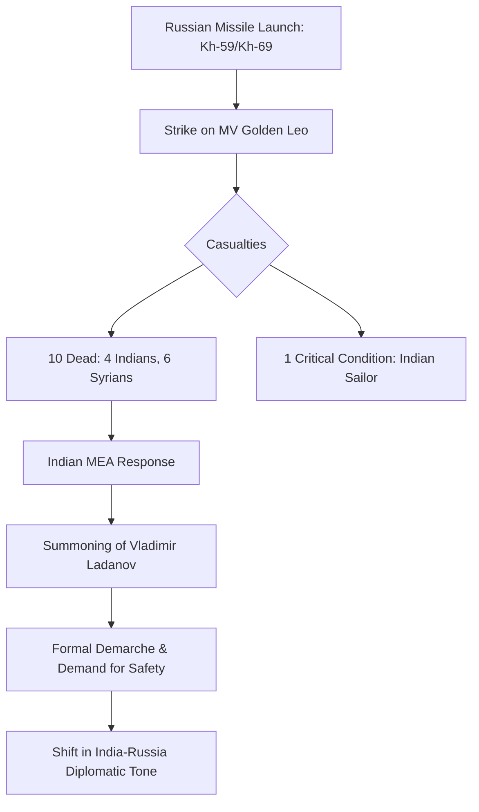

```yaml
title: "The MV Golden Leo Tragedy: A Turning Point for India-Russia Ties"
tags: [india-russia-relations, black-sea-conflict, maritime-security, geopolitics, merchant-navy, international-law, mv-golden-leo]
```

# 🚢 The MV Golden Leo Tragedy: Is This the Breaking Point for India and Russia?

Something profoundly heavy happened in the Black Sea recently, and it is sending shockwaves through the corridors of power in New Delhi and Moscow. On July 19, 2026, a commercial cargo ship, the *MV Golden Leo*, was navigating a perilous maritime corridor in Ukrainian waters when it was struck by Russian cruise missiles. This was not merely a loss of cargo or a statistical casualty of war; it was a visceral tragedy that claimed the lives of four Indian sailors, with another fighting for survival in a critical care unit.

For decades, India has mastered a diplomatic "tightrope walk," maintaining a "time-tested" friendship with Moscow while resisting Western pressure to take a hard stance against the invasion of Ukraine. This strategic autonomy has allowed India to secure energy needs and military hardware. However, when the conflict stops being a distant geopolitical chess match and starts claiming the lives of Indian citizens, the tone of diplomacy must—and does—shift.

The Indian Ministry of External Affairs (MEA) responded with a level of urgency and sharpness rarely seen in its dealings with Russia. By summoning the Russian chargé d’affaires, Vladimir Ladanov, for a formal and "unequivocal condemnation" of the strike, India signaled that its patience has a limit. This event marks the first time Indian sailors have been killed in this specific conflict, transforming a foreign war into a domestic tragedy hitting homes from Kerala to Uttar Pradesh.

---

## ⚓ What Actually Happened to the MV Golden Leo?

<div class="post-hero">
  
  <div class="post-hero-credit">📸 <a href="https://unsplash.com/@vizagexplore">Vizag Explore</a> on <a href="https://unsplash.com/photos/a-large-submarine-sitting-on-top-of-a-bridge-v8FciZPFKRY">Unsplash</a></div>
</div>


To understand the gravity of the incident, one must first understand the nature of the vessel. The *MV Golden Leo* was not a warship, nor was it carrying munitions. It was a merchant vessel flagged in Guinea-Bissau, owned by a Turkish conglomerate, and operated by a shipping firm headquartered in Mumbai. 

On the evening of July 19, 2026, the vessel was departing the port of Odesa. It was utilizing a specific maritime corridor established to facilitate the export of grain—a critical lifeline for global food security. While these corridors are intended to provide a "safe passage," they offer little to no actual protection against the saturation of high-tech weaponry.

According to intelligence from the Ukrainian Air Force and corroborating reports from [The Indian Express](https://indianexpress.com/article/world/india-summons-russian-diplomat-killing-indian-ship-crew-10796054/lite), the Russian military launched three cruise missiles of the **Kh-59/Kh-69** variety. One of these missiles struck the starboard side of the *Golden Leo* with devastating force. The impact was catastrophic, resulting in **10 immediate fatalities**—four Indians and six Syrians.

The ship carried a total crew of **17 members**, **five of whom were Indians**. Four perished in the initial explosion, while the fifth was evacuated under heavy guard to a nearby hospital in critical condition. This is not an isolated incident but part of a terrifying escalation in the Black Sea. Data from the Ukrainian Sea Ports Authority (USPA) indicates that in the first two weeks of July alone, Russia targeted **23 port facilities** and **17 civilian ships**, resulting in 11 deaths [Indian Express](https://indianexpress.com/article/world/india-summons-russian-diplomat-killing-indian-ship-crew-10796054/lite).



---

## 🏛️ The Diplomatic Weight of "Summoning" an Envoy

In the nuanced world of international diplomacy, the act of "summoning" an envoy is a significant escalation. It is the diplomatic equivalent of a "come to my office right now" demand. It bypasses the polite veneer of emails, memos, and scheduled briefings to deliver a face-to-face reprimand. On July 21, 2026, the Indian government summoned Vladimir Ladanov to convey its "grave concerns" and a formal condemnation [The Moscow Times](https://www.themoscowtimes.com/2026/07/21/india-summons-russian-envoy-over-killing-of-4-indian-sailors-a93295).

The MEA’s language was notably devoid of its usual ambiguity. They stated bluntly that targeting commercial ships and killing innocent civilians is **"unacceptable and must be avoided."** For a nation that has consistently avoided naming Russia as the primary aggressor in the Ukraine conflict to avoid jeopardizing its strategic interests, this is a tectonic shift.

> "Such attacks undermine the safety, security and stability of international maritime commerce," the Ministry of External Affairs stated in its official communication [The Moscow Times](https://www.themoscowtimes.com/2026/07/21/india-summons-russian-envoy-over-killing-of-4-indian-sailors-a93295).

This action constituted a "demarche"—a formal diplomatic protest. India is essentially reminding Moscow that while it may not have joined Western sanctions, the blood of its citizens is not acceptable "collateral damage." The demand was clear: Russia must ensure that commercial shipping is not targeted, reinforcing the principle of the **Freedom of Navigation**, which is the bedrock of global trade.

---

## 💔 The Human Cost: The Faces Behind the Statistics

Behind the geopolitical analysis and the diplomatic cables are shattered families. The men aboard the *MV Golden Leo* were not soldiers; they were merchant seafarers—essential workers who keep the global economy moving, often in complete anonymity. They joined the merchant navy to provide better lives for their families, unaware that they were sailing into a high-intensity missile zone.

The names of the fallen have begun to emerge, grounding the tragedy in reality. **Akhil Joyan, 26**, from Kasaragod, Kerala, and **Abhishek Nishad, 22**, from Deoria, Uttar Pradesh, were among those killed [Indian Express](https://indianexpress.com/article/world/india-summons-russian-diplomat-killing-indian-ship-crew-10796054/lite). Akhil’s story is particularly devastating; he had recently become engaged and was scheduled to be married in just two months [The Quint](https://www.thequint.com/news/breaking-news/india-summons-russian-diplomat-over-seafarers-deaths).

This tragedy also highlights a systemic vulnerability in the maritime industry: the "Flag of Convenience" (FOC) system. The *MV Golden Leo* was Indian-operated but Guinea-Bissau-flagged. Under FOC, ship owners register their vessels in countries with lax regulations to reduce costs and avoid taxes. However, when a crisis hits, this creates a legal nightmare. 

When a ship is flagged in a country like Guinea-Bissau, the crew's legal protections are often murky. The Indian diplomatic mission in Ukraine had to intervene directly to manage the medical care of the survivor and the repatriation of the bodies, as the flag state often lacks the resources or will to provide consular support [Gulf News](https://gulfnews.com/world/asia/india/india-summons-russian-envoy-over-ukraine-ship-attack-that-killed-four-indian-seafarers-1.500614991).

---

## ⚓ Why Indian Sailors are Historically Vulnerable

India is a global maritime powerhouse. The nation provides one of the largest cohorts of certified seafarers to the world's shipping fleets. In 2025, it was estimated that more than **320,000 active Indian seafarers** were deployed across global waters [The Moscow Times](https://www.themoscowtimes.com/2026/07/21/india-summons-russian-envoy-over-killing-of-4-indian-sailors-a93295). 

While the profession is prestigious and lucrative, it exposes sailors to extreme risks. They must constantly traverse global "chokepoints"—narrow maritime passages like the Red Sea, the Strait of Hormuz, the Malacca Strait, and the Black Sea. In these zones, civilian crews are frequently caught in the crossfire of state-sponsored warfare or non-state militant attacks.

The *MV Golden Leo* was sailing in a corridor designed to prevent a global food crisis. When such corridors are ignored by belligerent states, the risk is not just to the cargo (grain) but to the human beings steering the ship. When the MEA describes these attacks as "deplorable" [Aaj English TV](https://english.aaj.tv/news/330464458/india-summons-russian-envoy-over-missile-strike-that-killed-four-sailors), they are speaking for those **320,000+** citizens. The message is simple: if the "rules of the road" are discarded, every Indian sailor becomes a potential target.

---

## ⚖️ The Strategic Tightrope: Autonomy vs. Accountability

The relationship between India and Russia is a legacy of the Cold War, built on a foundation of military cooperation and mutual diplomatic support. Moscow has historically been India's most reliable supplier of defense equipment, from the MiG fighters to the S-400 Triumf missile systems. Since the 2022 invasion of Ukraine, India has resisted pressure from the US and EU to condemn Russia, adhering to its policy of "strategic autonomy."

However, this autonomy is now facing a moral and political crisis. The killing of four Indian sailors is a visceral event that cannot be smoothed over with diplomatic platitudes. While India may continue to purchase Russian oil to stabilize its economy, the government cannot appear indifferent to the death of its own people by Russian missiles.

There is a dark, poignant irony in this situation: India utilizes Russian-made defense systems to secure its own borders, yet its citizens are being killed by those same systems—specifically the **Kh-59/Kh-69 cruise missiles**—in the Black Sea. Russia’s relative silence on these specific allegations [Aaj English TV](https://english.aaj.tv/news/330464458/india-summons-russian-envoy-over-missile-strike-that-killed-four-sailors) suggests a diplomatic blunder. Moscow risks alienating one of its few remaining major non-Western allies in a war of attrition.

---

## 🌍 Global Implications and the Collapse of Maritime Law

This tragedy is a symptom of a larger collapse in the international order. The principle of **Freedom of Navigation**, codified under the [United Nations Convention on the Law of the Sea (UNCLOS)](https://www.un.org/depts/los/index.htm), dictates that commercial vessels should be able to move through international waters and designated corridors without fear of attack.

When a state employs precision-guided munitions on a civilian cargo ship, it is a direct assault on the laws of war. The use of **Kh-59/Kh-69 missiles** is particularly telling. These are not "dumb bombs" but precision instruments. Their use against the *MV Golden Leo* suggests one of two things:
1. A catastrophic intelligence failure where the Russian military misidentified a civilian ship as a military target.
2. A deliberate attempt to terrorize shipping companies, effectively blockading Ukrainian ports by making the cost of insurance and risk unbearable.

The ripple effects are already being felt. Shipping companies are increasingly refusing to enter Ukrainian waters, which leads to:
*   **Increased Insurance Premiums**: War-risk insurance for Black Sea voyages has skyrocketed.
*   **Supply Chain Disruptions**: Higher costs for grain exports.
*   **Global Food Inflation**: Poorer nations in Africa and Asia pay the price when grain corridors become death traps.

The *MV Golden Leo* is a case study in how the "invisible" workforce of the merchant navy pays the ultimate price when international law is treated as optional.

---

## 🚀 Future Outlook: Can the Partnership Survive?

Will this incident lead to a permanent rift between New Delhi and Moscow? Likely not. The interdependence in defense and energy is too deep. However, the *nature* of the partnership is changing. We are moving from a period of "unquestioning friendship" to one of "transactional caution."

India is likely to demand more explicit guarantees for the safety of its seafarers. We may see India increasing its own naval presence or coordination with international task forces to protect its citizens in conflict zones. Furthermore, this event provides India with more diplomatic leverage to push Russia toward a negotiated peace, arguing that the conflict is now directly harming Russian allies.

For the Russian Federation, the *MV Golden Leo* incident is a strategic liability. It provides the West with a narrative that Russia is "unpredictable" and "dangerous" even to its friends. If Moscow wishes to maintain its bridge to the Global South, it must demonstrate a commitment to the safety of civilian mariners.

---

## 🏁 Final Thoughts: A Wake-Up Call for the World

The loss of Akhil Joyan, Abhishek Nishad, and their colleagues is a tragedy that transcends the boundaries of geopolitics. It is a stark reminder that in the age of cruise missiles and hybrid warfare, no one is truly neutral. The "tightrope" India walks is becoming narrower, and the stakes have shifted from oil prices to human lives.

The Indian government's decision to summon the Russian envoy was not just a diplomatic necessity—it was a moral imperative. It sent a clear message to the world: the lives of Indian citizens are non-negotiable. 

As the families in Kerala and Uttar Pradesh mourn, the global community must realize how precarious the veins of international trade have become. The *MV Golden Leo* should serve as a global wake-up call. If the international community continues to allow the erosion of maritime law and the targeting of civilian sailors, the cost will be measured not in dollars or tons of grain, but in the lives of those who brave the seas to keep the world fed.

---

## 📚 References and Further Reading

- **The Moscow Times**: [India Summons Russian Envoy Over Killing of 4 Indian Sailors](https://www.themoscowtimes.com/2026/07/21/india-summons-russian-envoy-over-killing-of-4-indian-sailors-a93295)
- **The Indian Express**: [India summons Russia envoy over killing of 4 sailors](https://indianexpress.com/article/world/india-summons-russian-diplomat-killing-indian-ship-crew-10796054/lite)
- **Gulf News**: [India summons Russian envoy over Ukraine ship attack](https://gulfnews.com/world/asia/india/india-summons-russian-envoy-over-ukraine-ship-attack-that-killed-four-indian-seafarers-1.500614991)
- **The Quint**: [India Summons Russian Envoy After 4 Indians Killed in Attack Off Ukraine Coast](https://www.thequint.com/news/breaking-news/india-summons-russian-diplomat-over-seafarers-deaths)
- **Aaj English TV**: [India summons Russian envoy over missile strike](https://english.aaj.tv/news/330464458/india-summons-russian-envoy-over-missile-strike-that-killed-four-sailors)
- **International Maritime Organization (IMO)**: [Guidelines on Maritime Security and Seafarer Welfare](https://www.imo.org)
- **United Nations**: [UNCLOS - Convention on the Law of the Sea](https://www.un.org/depts/los/index.htm)
- **Council on Foreign Relations (CFR)**: [Analysis of India-Russia Strategic Ties](https://www.cfr.org)
- **Brookings Institution**: [Global Food Security and the Black Sea Grain Corridor](https://www.brookings.edu)
- **Maritime Executive**: [Understanding Flags of Convenience and Crew Liability](https://maritime-executive.com)