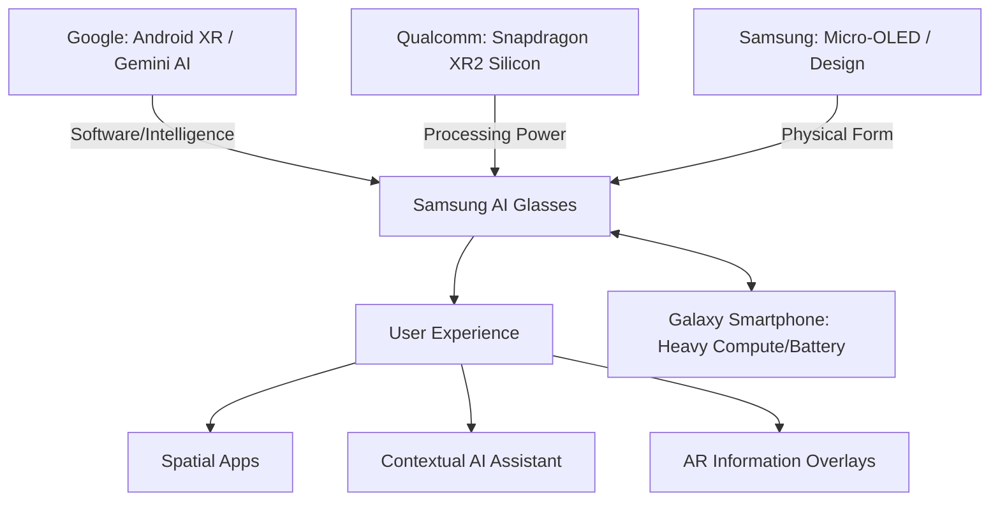

```yaml
title: "Samsung & Android XR: Challenging the Spatial Computing Throne"
tags: [android-xr, samsung, spatial-computing, augmented-reality, google-gemini, wearables, qualcomm, ai-glasses]
```

# 👓 The Glass Revolution: How Samsung and Android XR Are Challenging the Spatial Computing Throne

The trajectory of personal computing has always been defined by the "barrier" between the user and the data. For decades, that barrier was a bulky desktop monitor. Then, it shrank into a handheld piece of glass we carry in our pockets. For the last fifteen years, the smartphone has been the undisputed center of our digital existence, dictating how we communicate, work, and perceive reality. However, we are currently witnessing the dawn of the "post-smartphone" era.

Samsung is betting its future on a radical new vision for wearables: AI-powered smart glasses running on a specialized platform called **Android XR**. This is not merely another peripheral or a niche gadget for early adopters; it is a calculated, strategic strike against Apple’s closed-off Vision Pro ecosystem. By moving the interface from the palm of our hand to the line of our sight, Samsung is wagering that the world is finally ready to stop staring down at screens and start interacting with a digital layer woven directly into the physical world.

To execute this pivot, Samsung has forged a "power trio" alliance with Google and Qualcomm. This partnership is designed to replicate the success of the Android mobile revolution—creating an open, scalable system that can iterate rapidly across multiple hardware tiers and reach billions of users. By blending high-performance silicon, generative AI, and cutting-edge display technology, this coalition is attempting to transform "spatial computing" from a luxury curiosity into a daily utility.

---

## 🚀 The Grand Alliance: Samsung, Google, and Qualcomm

<div class="post-hero">
  
  <div class="post-hero-credit">📸 <a href="https://unsplash.com/@jupp">Jonathan Kemper</a> on <a href="https://unsplash.com/photos/logo-poSms2EzfNY">Unsplash</a></div>
</div>


The true strength of the Samsung XR project lies not in a single piece of hardware, but in the strategic synergy of three industry titans. In the world of high-end tech, Apple typically employs a "vertical integration" model, controlling the chip, the OS, and the industrial design. Samsung is pursuing a "horizontal ecosystem" strategy, leveraging the specialized strengths of its partners to outpace Apple’s singular vision.

According to reports from [GSMArena](https://www.gsmarena.com), the division of labor is precisely calibrated: **Google provides the cognitive layer (Android XR and Gemini AI), Qualcomm engineers the nervous system (Snapdragon XR silicon), and Samsung constructs the physical body (Micro-OLED displays and industrial design).**

### The Strategic Value Proposition
This partnership solves the "innovation bottleneck" that plagues most AR startups. Building a viable spatial computer requires three distinct, world-class competencies:

1.  **The AI & Software Layer (Google):** Google possesses the world's most advanced multimodal AI in Gemini and a massive global developer base. By building **Android XR**, Google ensures that the glasses are not an isolated island but an extension of the existing Android ecosystem.
2.  **The Silicon Foundation (Qualcomm):** Spatial computing is computationally expensive. Qualcomm’s [Snapdragon XR2 platform](https://www.qualcomm.com) is specifically architected for the low-latency, high-throughput demands of SLAM (Simultaneous Localization and Mapping) and 3D rendering.
3.  **The Hardware Execution (Samsung):** Samsung is the global leader in high-density display manufacturing. Their ability to produce **Micro-OLED panels** at scale is the "secret weapon" that allows the device to remain slim while maintaining visual fidelity.

As noted by analysts on [Hacker News](https://news.ycombinator.com), this "open garden" approach is a direct counter-move to Apple's "walled garden." By allowing a wider array of hardware configurations and developer access, Samsung and Google hope to achieve critical mass before Apple can lower the price point of the Vision Pro.

> "The goal isn't just to create a headset, but to create a platform. By combining Google's software expertise with Samsung's hardware prowess and Qualcomm's silicon, they are building a full-stack alternative to the Vision Pro that prioritizes accessibility over exclusivity."

---

## 🛠️ The Hardware Architecture: Engineering the Invisible

Moving from a "headset" (like the Quest 3) to "glasses" requires overcoming brutal laws of physics. The primary enemies are **heat dissipation, weight distribution, and battery density**. If a device feels like a brick on the user's face or burns their temple, it will never achieve mass adoption.

### The Silicon Heart: Snapdragon XR2 Gen 2
The core of the device is expected to be the **Snapdragon XR2 Gen 2**. Unlike a standard mobile chip, this processor is designed for "spatial awareness." It must handle a constant stream of data from multiple cameras and sensors to map the environment in real-time without draining the battery in an hour. **Bold stats indicate that the newer XR2 iterations offer up to a 50% increase in AI processing power** compared to the first generation, which is critical for running on-device machine learning models.

### Display Technology: The Micro-OLED Breakthrough
To eliminate the "screen-door effect"—the visible gaps between pixels that plagued early devices like the [Samsung Gear VR](https://en.wikipedia.org/wiki/Samsung_Gear_VR)—Samsung is deploying **Micro-OLED technology**. These displays offer:
- **Extreme Pixel Density:** Potentially reaching **4K resolution per eye**, mirroring the clarity of human vision.
- **Infinite Contrast:** True blacks that allow virtual objects to blend seamlessly with the real world.
- **Low Power Draw:** Efficiency that extends the limited battery life of a glasses frame.

### The Sensor Suite: Creating "Digital Sight"
These glasses don't just project images; they perceive the world. The hardware architecture integrates:
- **High-Resolution RGB Cameras:** For Visual Question Answering (VQA) and environment analysis.
- **LiDAR/ToF Sensors:** Using Light Detection and Ranging to create a centimeter-accurate 3D mesh of the user's surroundings.
- **IMUs (Inertial Measurement Units):** Ensuring that a virtual window "pinned" to a wall stays there even if the user turns their head rapidly.
- **Beamforming Microphones:** Using AI to isolate the user's voice from ambient noise, enabling seamless voice commands.

### The "Split-Processing" Solution
To solve the battery crisis, Samsung is likely employing a **split-processing architecture**. Instead of cramming a massive battery and a hot CPU into the frames, the glasses handle the "immediate" tasks (sensor polling, display refreshing), while the "heavy lifting" (complex AI reasoning, 3D rendering) is offloaded to a paired Galaxy smartphone via a high-bandwidth, low-latency wireless link.



---

## 🧠 The AI Engine: Gemini and Contextual Awareness

The fundamental difference between these glasses and the failed "Google Glass" of 2013 is the leap from **Deterministic AI** to **Generative AI**. Early smart glasses were essentially "notification mirrors"—they showed you a text or a direction. Samsung's AI glasses, powered by **Google Gemini**, provide **Contextual Awareness**.

### Visual Question Answering (VQA)
By integrating Large Language Models (LLMs) with computer vision, the glasses can perform what researchers call "Visual Question Answering." According to papers on [ArXiv](https://arxiv.org/abs/2303.12712), the integration of multimodal LLMs allows a device to understand not just *what* an object is, but *how it relates* to the user's current goal.

**Practical Example:** If you are repairing a sink, the glasses can identify the specific valve you are looking at and overlay a 3D animation showing exactly which way to turn it. This isn't a pre-recorded video; it's an AI-generated guide based on the real-time visual feed of your specific sink.

### The Proactive Assistant (Galaxy AI)
Through **Galaxy AI**, the glasses move from being reactive to proactive. By analyzing your calendar, emails, and location, the AI can provide "just-in-time" information:
- **Social Cues:** "You are meeting Sarah; the last time you spoke was in June about the Q3 budget."
- **Navigation:** Instead of a 2D map, a glowing blue line appears on the actual pavement in front of you.
- **Health Integration:** Linking with a Galaxy Watch to detect high stress levels and automatically filtering out non-urgent notifications to reduce cognitive load.

**Core AI Capabilities Expected:**
- **Instant Translation:** Real-time subtitles for foreign speech, appearing as floating text beneath the speaker's face.
- **Object Identification:** Instantly identifying a plant species or a piece of industrial machinery and providing a wiki-link.
- **Live Transcription:** Converting a spoken meeting into a floating text document that can be saved to Google Docs instantly.
- **Adaptive UI:** The interface simplifies when you are walking (to ensure safety) and expands when you are seated at a desk.

---

## 📱 Android XR: The New Spatial Operating System

**Android XR** is not a skin applied to Android; it is a fundamental reimagining of the OS. In traditional computing, the screen is the boundary. In Android XR, **the environment is the canvas**.

### Spatial Anchors and Persistence
One of the most transformative features of Android XR is the use of **Spatial Anchors**. This allows the OS to remember the exact 3D coordinates of a virtual object. You can "pin" a virtual monitor to your office wall, leave a digital sticky note on your refrigerator, or place a floating weather widget in your hallway. When you return to those locations, the OS recognizes the environment and snaps the virtual objects back into their precise physical positions.

### The New Interaction Paradigm
We are moving away from the "touch-and-tap" era. Android XR introduces a multimodal interaction system:
1.  **Eye-Tracking:** The system knows exactly what you are looking at, making the "gaze" the primary cursor.
2.  **Micro-Gestures:** Using high-frequency cameras to detect "pinches" or "swipes" in the air, allowing for precise control without needing a physical controller.
3.  **Voice Command:** Natural language processing via Gemini, allowing for complex queries like, *"Find the email from last week about the project and project it over the table."*

### Developer Ecosystem and Migration
The genius of using Android XR is the "bridge" it builds for developers. Google is creating a **Spatial SDK** that allows existing Android app developers to "spatial-ize" their apps. A weather app doesn't need to be rewritten; it just needs to be told how to render its data in a 3D window. This ensures that Samsung's glasses launch with a library of thousands of apps, avoiding the "ghost town" effect that killed previous AR attempts.

---

## 🥊 The Competitive Arena: Vision Pro vs. Galaxy XR

The battle for the future of computing is a clash of two fundamentally different philosophies: **Apple's "Digital Replacement"** and **Samsung's "Digital Augmentation."**

The Apple Vision Pro is an engineering marvel, but it is designed as an "immersive" device. It aims to replace your surroundings with a high-resolution digital environment. Samsung, conversely, is focusing on "augmentation"—adding a helpful digital layer to the world you already see.

| Feature | Apple Vision Pro | Samsung AI Glasses (Expected) |
| :--- | :--- | :--- |
| **Core Philosophy** | Immersive Computing (Replacement) | Augmented Reality (Enhancement) |
| **OS Ecosystem** | visionOS (Closed/Proprietary) | Android XR (Open/Collaborative) |
| **Form Factor** | Goggle-style Headset | Slim Glasses / Light Frame |
| **AI Integration** | Siri / Local ML | Google Gemini / Galaxy AI |
| **Price Point** | **$3,499 (Ultra-Premium)** | **Premium/Mass Market (Estimated $1k-$2k)** |
| **Connectivity** | Standalone / Mac Ecosystem | Paired with Android/Galaxy Ecosystem |
| **Primary Use** | Entertainment / High-End Work | Daily Utility / AI Assistance |

The victory in this war will not be decided by raw specs, but by **friction**. The Vision Pro is a "destination" device—you put it on to *do* something. Samsung is aiming for a "transparent" device—something you wear all day without thinking about it. If Samsung can solve the weight and battery issues, they will capture the mass market by making spatial computing an invisible part of daily life.

---

## ⚠️ The Hurdles: Privacy, Battery, and Social Acceptance

Despite the potential, the road to mass adoption is littered with significant obstacles.

### The "Creepiness Factor" and Privacy
The social stigma of wearing cameras on your face is a massive hurdle. From the early days of Google Glass, the public has reacted poorly to "walking surveillance cameras." To combat this, Samsung will likely implement:
- **Hardware-Level Indicators:** A bright, unblockable LED that signals when the camera is active.
- **On-Device Processing:** Ensuring that video feeds for AI analysis are processed locally and deleted immediately, rather than being uploaded to the cloud.
- **Privacy Zones:** Software-level blocks that prevent the glasses from recording or analyzing data in sensitive areas (like bathrooms or hospitals).

### The Thermal Ceiling
Processing 4K video and running a generative AI model in real-time generates an immense amount of heat. In a slim glasses frame, there is nowhere for that heat to go. If the frames reach a temperature that is uncomfortable against the skin, the product fails. This makes the **split-processing** mentioned earlier a necessity, not a luxury. By offloading the heat-intensive compute to a phone in the pocket, Samsung can keep the glasses cool.

### The Search for the "Killer App"
History is full of "cool" gadgets that failed because they weren't "useful." VR headsets often become expensive paperweights after the novelty wears off. Samsung is betting that **Generative AI** is the "Killer App." The goal is to make the glasses a tool for productivity and cognitive enhancement—a "digital exoskeleton for the mind"—rather than just a gaming accessory.

> "The success of smart glasses depends not on the hardware, but on the 'invisible' software. If the AI can accurately predict what I need before I ask for it, the screen becomes irrelevant."

---

## 🚀 The Future Outlook: Toward the End of the Handheld Era

Samsung's entry into the XR space with Android XR marks a pivotal shift in the history of technology. We are transitioning from the era of "looking down" (at phones and tablets) to the era of "looking through" (spatial computing). 

By leveraging the combined might of Google's AI and Qualcomm's silicon, Samsung is not just launching a product; they are attempting to define the **operating system of the physical world**. When the digital world is no longer trapped in a 6-inch piece of glass in your pocket, but is instead woven into the fabric of your environment, the way we work, learn, and interact will fundamentally change.

The "War of the Glasses" has officially begun. While Apple has the early lead in raw immersion, Samsung and Google have the advantage of scale, openness, and the world's most powerful AI. The result will be the defining shift in personal computing for the next twenty years.

---

## 📚 References

- [GSMArena: Samsung and Google's XR Collaboration and Leak Analysis](https://www.gsmarena.com)
- [Qualcomm: Snapdragon XR Series Technical Overview](https://www.qualcomm.com)
- [Wikipedia: Extended Reality (XR) and the Spectrum of Virtualization](https://en.wikipedia.org/wiki/Extended_reality)
- [Wikipedia: The Evolution of Samsung Gear VR](https://en.wikipedia.org/wiki/Samsung_Gear_VR)
- [ArXiv: Multimodal Large Language Models in Augmented Reality Environments](https://arxiv.org/abs/2303.12712)
- [Hacker News: Community Discourse on the Android XR Ecosystem](https://news.ycombinator.com)
- [Google DeepMind: Gemini AI Multimodal Capabilities](https://deepmind.google/technologies/gemini/)
- [Samsung Newsroom: The Integration of Galaxy AI in Wearables](https://news.samsung.com)
- [IEEE Xplore: Low-Latency Wireless Communication for Split-Processing XR](https://ieeexplore.ieee.org)
- [Android Developers: Introduction to Spatial Computing APIs](https://developer.android.com)