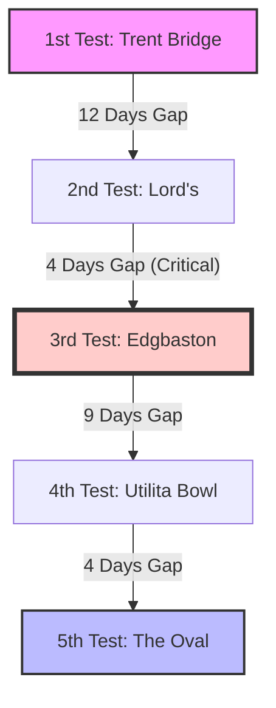

```yaml
title: "The Return of the Nottingham Roar: 2027 Ashes Analysis"
tags: [cricket, ashes-2027, england-cricket, australia-cricket, trent-bridge, sports-analysis, ecb, test-cricket]
```

# 🏏 The Return of the Nottingham Roar: Breaking Down the 2027 Ashes Schedule

The Ashes is far more than a sequence of five Test matches; it is a psychological war of attrition, a clash of sporting cultures, and a living history book that has been meticulously written over nearly 150 years. For the fans, it is the pinnacle of the summer; for the players, it is a career-defining crucible. When the England and Wales Cricket Board (ECB) finally unveiled the schedule for the 2027 Men's Ashes, the cricketing world immediately pivoted its attention toward Nottingham. The announcement that [Trent Bridge will host the series opener](https://www.trentbridge.co.uk/news/2026/july/2027-mens-ashes-dates-confirmed-as-international-summer-finalised.html) signals a return to tradition for one of England's most iconic and atmospheric grounds.

For the England squad, the 2027 summer is not merely about winning a trophy—it is about redemption. After suffering a brutal **4-1 loss** in Australia during the 2026-27 series, the team enters this home campaign under an immense cloud of expectation and scrutiny. The roadmap for 2027 is designed for maximum drama, blending the hallowed turf of traditional venues with a historic first for the south coast. From the swing-friendly, unpredictable pitches of West Bridgford to the modern, clinical setup at the Utilita Bowl, this series promises to be a grueling physical and mental battle. 

This analysis dives deep into the dates, the strategic implications of the venues, the political controversies surrounding the schedule, and the psychological hurdles England must overcome to reclaim the urn.

---

## 🏟️ The Return of the Nottingham Roar: Trent Bridge Takes Center Stage

<div class="post-hero">
  
  <div class="post-hero-credit">📸 <a href="https://unsplash.com/@aksh1802">Aksh yadav</a> on <a href="https://unsplash.com/photos/crowd-of-people-sitting-on-stadium-seats-bY4cqxp7vos">Unsplash</a></div>
</div>


There is a specific, electric energy at Trent Bridge during an Ashes summer that is distinct from any other ground in the UK. For the city of Nottingham and the Nottinghamshire County Cricket Club, the confirmation that the [first Test starts on June 18, 2027](https://sports.yahoo.com/articles/ashes-2027-schedule-dates-start-100225356.html) is a monumental event. Trent Bridge has not opened an Ashes series since 2013, and its absence from the opening slot for over a decade has been felt by the local faithful. Bringing the opener back to Nottingham is a calculated move by the ECB to ignite the series in a location renowned for its passion and volatility.

Historically, Australia has endured some of its most harrowing experiences in West Bridgford. The most enduring memory remains the 2015 clash, where Stuart Broad produced a spell of bowling that bordered on the supernatural, dismantling the Australian lineup and bowling them out for a staggering **60 runs** in the first innings. That performance did more than secure a victory; it established Trent Bridge as a psychological graveyard for Australian batters when English conditions are optimal. The ground is aesthetically beautiful, but it possesses a notorious knack for making the ball swing late and sharp, turning the first Test into a high-stakes gamble for the visitors.

> “Any international cricket fixture at Trent Bridge is special, but nothing quite matches the Men’s Ashes. The Ashes is cricket’s most historic rivalry—and even after over 200 years, it remains one of its most hotly-anticipated and keenly-fought.” — **Michael Temple, Nottinghamshire’s Commercial Director** ([Source](https://www.trentbridge.co.uk/news/2026/july/2027-mens-ashes-dates-confirmed-as-international-summer-finalised.html))

The 2027 opener also coincides with the grand opening of the ground's redeveloped Pavilion. This architectural upgrade ensures that the "pomp and ceremony" of the Ashes are supported by world-class facilities, blending Victorian charm with contemporary luxury. Strategically, starting here is a masterstroke for England; having won their last three Ashes Tests at this venue, they view Trent Bridge as a fortress. If England can secure a victory in the first five days, they will carry a wave of momentum into the heart of the summer. Conversely, a loss here would leave them reeling, giving Australia the psychological upper hand for the remainder of the tour.

---

## 📅 Decoding the 2027 Calendar: A Sprint to the Finish

The 2027 Ashes is structured as a six-week gauntlet, spanning from June 18 to August 2. The timing is surgically precise, designed to fit within the English summer while providing a narrow window for England to prepare for the [2027 ICC Men's Cricket World Cup](https://www.icc-cricket.com) in southern Africa. The selection of venues takes the series through the geographical and cultural heart of English cricket, testing the players' endurance and adaptability.

### The Official 2027 Itinerary:
1. **Trent Bridge (Nottingham):** June 18-22
2. **Lord's (London):** June 30-July 4
3. **Edgbaston (Birmingham):** July 8-12
4. **Utilita Bowl (Southampton):** July 21-25
5. **The Oval (London):** July 29-August 2

A critical point of concern for the England medical and coaching staff is the turnaround between the second and third Tests. There is a [scheduled break of only four days](https://www.houstonchronicle.com/sports/article/trent-bridge-to-kick-off-the-2027-men-s-ashes-as-22356856.php) between the conclusion of the Lord's Test and the commencement of the Edgbaston match. In the context of Test cricket, where athletes are pushed to their absolute physical and mental limits, this window is punishing. 

Recovery time is minimized, placing a premium on squad depth. If England is forced to rely on a consistent XI without rotation, the risk of soft-tissue injuries increases significantly. Given that momentum is the primary currency of the Ashes, the rapid transition from the prestige of London to the cauldron of Birmingham could be the exact moment where the series is won or lost.



The series concludes at The Oval, adhering to long-standing tradition. By late July and early August, the pitches in South London typically begin to degrade, creating an environment that heavily favors spin bowlers. This gives the 2027 series a clear narrative arc: it begins with the seam and swing of Nottingham and concludes with the attrition and spin of The Oval. Australia must adapt their strategy in real-time as the conditions shift, while England will rely on their home-field advantage to erase the memory of their recent failures in the Southern Hemisphere.

---

## 🗺️ The North-South Divide: A Controversy Ignited

While the schedule provides a clear timeline, it has simultaneously ignited a fierce debate regarding the distribution of Test cricket across England. The 2027 itinerary contains one glaring omission: the North of England. Both **Old Trafford** in Manchester and **Headingley** in Leeds—two of the most electric and historically significant grounds in the world—have been excluded entirely.

This omission has created significant friction between the ECB and regional leadership. The mayors of Greater Manchester and West Yorkshire have publicly expressed their disappointment, arguing that the passionate fanbase of the North is being marginalized in favor of southern convenience. Even England's captain, Ben Stokes, has voiced his concerns. Reflecting on the [4-1 defeat in Australia](https://www.houstonchronicle.com/sports/article/trent-bridge-to-kick-off-the-2027-men-s-ashes-as-22356856.php), Stokes described the absence of northern Tests as "a shame," citing the unique, raucous support found at Headingley and Old Trafford that often acts as a "twelfth man" for the England team.

This "North-South Divide" is not merely a logistical or geographic dispute; it is a question of accessibility and inclusivity within the sport. By placing four of the five Tests in the Midlands and the South, the ECB risks alienating a core segment of its supporters. In an attempt to mitigate the backlash, the board has confirmed that Headingley and Old Trafford are guaranteed slots for the **2031 series**.

As a minor concession, Old Trafford will host a warm-up fixture between Australia and the England Lions from June 7-10. While a Lions match does not carry the weight or prestige of an Ashes Test, it ensures that the Australian squad experiences northern conditions before heading to Nottingham. Nevertheless, the exclusion remains a primary talking point, framing the 2027 series as one of commercial optimization rather than regional representation.

---

## 🌟 The Utilita Bowl: A Modern Giant Enters the Ashes

A landmark moment of the 2027 schedule is the inclusion of the Utilita Bowl in Southampton. For the first time in the history of the Men's Ashes, this venue (formerly known as the Rose Bowl) will host a Test. This designation makes it the [10th British ground to ever host a men's Ashes Test](https://www.houstonchronicle.com/sports/article/trent-bridge-to-kick-off-the-2027-men-s-ashes-as-22356856.php), introducing a contemporary element to a rivalry that traditionally clings to its heritage.

The Utilita Bowl is a marvel of modern sports engineering. Unlike the organic, sprawling, and often cramped layouts of Lord's or The Oval, the Bowl was designed from the ground up with a distinctive circular configuration. It has already proven its ability to handle the highest pressure, most notably hosting the **2019 Cricket World Cup final**. Its facilities are among the finest globally, offering a level of spectator comfort and corporate luxury that often surpasses the older, tighter venues in London and Birmingham.

The ECB's decision to include Southampton reflects a strategic shift toward venues that maximize revenue and enhance the overall fan experience. However, this has drawn criticism from purists who question whether a modern stadium can possess the "ghosts" and the historical weight required for an Ashes Test. Does a venue without a century of heartbreak and triumph carry the same psychological pressure?

The fourth Test (July 21-25) will be the ultimate litmus test for this theory. The Bowl generally offers a balanced contest between bat and ball, lacking the extreme biases found at some of the older grounds. For Australia, playing at a relatively "neutral" site may be an advantage, as there are no decades of "Australian failures" embedded in the turf. For England, it is an opportunity to establish a new stronghold in the south.

---

## ⚔️ Tactical Analysis: Bazball vs. The Australian Machine

The 2027 series will serve as the definitive trial for "Bazball"—the ultra-aggressive, high-risk philosophy spearheaded by Ben Stokes and Brendon McCullum. Since its inception, Bazball has revitalized Test cricket, turning draws into results and making the game a spectator's delight. However, the **4-1 loss** in Australia exposed the potential flaws in this approach.

Australia’s strategy is the antithesis of Bazball. They play a clinical, disciplined, and risk-averse game designed to exhaust the opponent. While England seeks to dictate the tempo through aggression, Australia is content to let the game come to them, relying on superior fielding and relentless accuracy.

### The Conflict of Philosophies:
*   **England's Goal:** To maintain a scoring rate that puts Australia on the defensive, forcing mistakes through sheer pressure and psychological intimidation.
*   **Australia's Goal:** To absorb the pressure, utilize their world-class spin attack in the later stages of the game, and punish England's aggressive shot-making with precise traps.

With the varying pitches of 2027, England faces a tactical dilemma. In the swing-heavy conditions of Trent Bridge, aggression can be a weapon. However, on the wearing pitches of The Oval, the "Bazball" approach may be too reckless. The coaching staff must decide whether to double down on their aggression or reintegrate traditional, grinding Test techniques to secure the urn.

---

## 🧠 The Psychological War: Healing from the 4-1 Defeat

To understand the gravity of the 2027 schedule, one must examine the trauma of the previous encounter. England's **4-1 loss** in Australia during the 2026-27 series was more than a defeat; it was a systemic failure. The Australian side didn't just win; they dismantled England's confidence, exposing a lack of resilience in the top order and a vulnerability to high-quality spin.

Starting the home series at Trent Bridge is a calculated psychological maneuver. England requires a victory in the first Test to silence critics and dismantle the aura of invincibility that currently surrounds the Australian squad. The memory of the **2015 rout** will be weaponized by fans and media to create an atmosphere of extreme intimidation. 

> "Ashes loss will haunt England for years," warned Michael Atherton, fearing long-term damage to the team's confidence after the Australian series ([Source](https://www.cricketnews.com/en/cricket/news/ashes-loss-haunt-england-michael-atherton-fears-long-term-damage/887025c5cb0961a59f041a5e)).

If England wins in Nottingham, they enter Lord's with a renewed sense of belief. If they stumble, the pressure will become exponential, and the series could realistically be decided before the mid-summer break. The 2027 series is not just about cricket; it is about the mental recovery of a national team.

---

## 🌏 The Broader Horizon: A Summer of Global Cricket

The Men's Ashes is the centerpiece, but the 2027 summer is one of the most congested in the history of English cricket. Most significantly, the **Women's Ashes** will run concurrently with the men's series. The ECB's decision to synchronize these events is a strategic effort to unify the fanbases and elevate the profile of the women's game.

The Women's Ashes will commence with a Test at Headingley (June 24-27), marking the first time the women's team has played a Test at that venue since 2001. This is followed by three T20s and three ODIs, concluding on July 20. By integrating the two series, the ECB is transforming the Ashes from a single event into a gender-inclusive celebration of the sport.

Beyond the Ashes, the 2027 calendar is grueling:
*   **May:** A five-match ODI series against Pakistan to calibrate the limited-overs squad.
*   **Early Summer:** A home Test against Bangladesh at Lord's, a rare occurrence not seen since 2010.
*   **September:** A high-intensity tour by New Zealand featuring three T20s and five ODIs.

This scheduling serves two primary purposes. First, it maximizes commercial revenue from touring nations. Second, it acts as a high-performance boot camp for the [2027 ICC Men's Cricket World Cup](https://www.icc-cricket.com) in southern Africa this October. The New Zealand series in September will be critical, serving as the final audition for players vying for a spot in the 50-over World Cup squad.

The overarching concern, however, is player fatigue. Between the mental toll of the Ashes and the physical demands of the World Cup, the ECB's workload management—particularly for the fast-bowling contingent—will be just as decisive as the tactics employed on the pitch.

---

## 🏏 Key Player Battles to Watch in 2027

While the team dynamics are crucial, the Ashes is often decided by individual duels. Several key matchups will define the trajectory of the 2027 series:

1.  **The Swing Specialists:** England's opening bowlers vs. Australia's top order. In the humid June air of Nottingham, the ability to find late swing will be the difference between a collapse and a century.
2.  **The Spin War:** As the series moves to The Oval, the battle between England's primary spinner and Australia's middle order will intensify. The ability to extract turn from a wearing August pitch is where the series will likely be sealed.
3.  **The Captaincy Clash:** Ben Stokes' intuitive, aggressive leadership against the structured, disciplined approach of the Australian captain. This is a clash of egos and philosophies.

---

## 🏁 Conclusion: More Than Just a Game

The 2027 Ashes schedule is a reflection of cricket's current evolution. The return of Trent Bridge as the series opener demonstrates a deep respect for the roots of the rivalry, while the debut of the Utilita Bowl signals a commitment to modernization and commercial growth.

England stands at a historical crossroads. They can allow the **4-1 defeat** in Australia to become a permanent scar on their psyche, or they can use the Nottingham roar as the catalyst for a historic comeback. For Australia, the objective is clear: maintain their hegemony and prove that their dominance is not merely a product of home conditions, but a result of systemic superiority.

As we count down to June 18, 2027, the stakes have never been higher. The Ashes remain the peak of Test cricket because they represent a total struggle for supremacy. Whether it is the late swing in West Bridgford or the roar of the crowd in South London, the 2027 series promises to be an epic. The schedule is set, the grounds are prepared, and the world will be watching to see who holds the urn when the dust settles in August.

---

## 📚 References

- **Yahoo Sports / Cricket News:** [Men's Ashes 2027 schedule: Dates, start date, venues and full fixtures](https://sports.yahoo.com/articles/ashes-2027-schedule-dates-start-100225356.html)
- **Trent Bridge Official:** [2027 Men’s Ashes Dates Confirmed as International Summer Finalised](https://www.trentbridge.co.uk/news/2026/july/2027-mens-ashes-dates-confirmed-as-international-summer-finalised.html)
- **Houston Chronicle / AP:** [Trent Bridge to kick off the 2027 men's Ashes as England hosts Australia](https://www.houstonchronicle.com/sports/article/trent-bridge-to-kick-off-the-2027-men-s-ashes-as-22356856.php)
- **Cricket News:** [Michael Atherton fears long-term damage after AUS vs ENG Test series defeat](https://www.cricketnews.com/en/cricket/news/ashes-loss-haunt-england-michael-atherton-fears-long-term-damage/887025c5cb0961a59f041a5e)
- **ICC Official:** [International Cricket Council - World Cup Schedules](https://www.icc-cricket.com)
- **ECB Official:** [England and Wales Cricket Board - International Summer](https://www.ecb.co.uk)
- **ESPNcricinfo:** [Ashes Historical Statistics and Venue Analysis](https://www.espncricinfo.com)
- **Cricbuzz:** [Player Profiles and Current Form Analysis](https://www.cricbuzz.com)