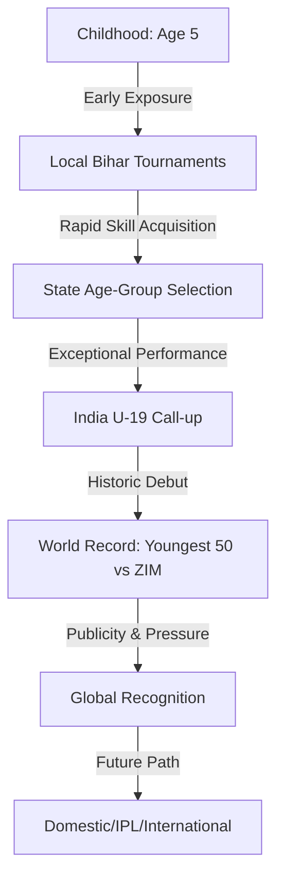

```yaml
title: "The 12-Year-Old Prodigy: Vaibhav Sooryavanshi’s Rise"
tags: [cricket, india-u19, vaibhav-sooryavanshi, youth-sports, bihar-cricket, world-record, bcci, sports-prodigies]
```

# 🏏 The 12-Year-Old Who Shook Up Indian Cricket: Vaibhav Sooryavanshi’s Historic Run

## 🌟 Introduction: A Kid Way Ahead of His Time

In the high-stakes arena of international cricket, the pitch is typically reserved for those who have reached a certain threshold of physical maturity. The game demands not just technical skill, but the raw power to clear boundaries and the physical stamina to endure grueling sessions under a scorching sun. Usually, players enter the Under-19 circuit after years of grinding through district and state age-group levels, arriving at the national stage as young adults. Seeing a pre-teen on the pitch is almost unheard of in the modern era.

However, during a landmark encounter between **India U-19 and Zimbabwe U-19**, the cricketing world witnessed a phenomenon that defied conventional logic. Enter **Vaibhav Sooryavanshi**, a 12-year-old from Bihar who didn't just participate—he dominated. 

Imagine the scene: a boy who looks like he belongs in a primary school classroom standing at the crease, facing bowlers who are nearly six years his senior. These opponents are in the peak of their adolescent growth spurts, possessing muscle mass and height that dwarf the young opener. To the casual observer, Vaibhav appeared like a schoolboy who had accidentally wandered onto a professional field. But the moment he took his guard, the narrative shifted. With a level of composure rarely seen even in seasoned professionals, he etched his name into the history books. 

Vaibhav has now become the **youngest player to ever represent India in an Under-19 match and the youngest to score a half-century in one**. This was not a fluke, a "participation trophy" moment, or a result of lenient bowling. It was a clinical display of technical precision and mental fortitude. By crossing the 50-run threshold, Vaibhav proved a fundamental truth of sport: when talent is this profound, the date on a birth certificate becomes irrelevant.

---

## 🏟️ The Moment of History: IND vs ZIM

The atmosphere surrounding the India U-19 series against Zimbabwe was electric, largely fueled by the curiosity surrounding this "12-year-old wonder boy." The anticipation reached a fever pitch when Vaibhav walked out to open the innings. The visual contrast was stark; the Zimbabwe bowlers, aged 17 and 18, looked like giants compared to the diminutive figure of Sooryavanshi.

Yet, as the first ball was delivered, any doubts about his suitability for the level vanished. Vaibhav displayed a sophisticated understanding of the game, playing with a smooth, effortless style that suggested he had played this level for years. He hit a [historic milestone](https://www.timesofindia.indiatimes.com/sports/cricket/india-u19-vaibhav-sooryavanshi-becomes-youngest-player-to-score-fifty-in-u19-internationals/articleshow/114582134.cms) by smashing a half-century with a strike rate that left the Zimbabwean attack scrambling for answers.

**The Statistical Breakdown of the Achievement:**
*   **Age at Milestone:** Approximately **12 years and 284 days**.
*   **Role:** Opening Batter.
*   **Achievement:** Youngest player to score a 50 in India U-19 representative cricket.
*   **Opponent:** Zimbabwe U-19.
*   **Impact:** Provided a rapid start that demoralized the opposing bowling unit.

Vaibhav's innings was a masterclass in strike rotation and boundary hitting. He didn't rely solely on raw power—which he lacks compared to his peers—but on pinpoint accuracy and gap-finding. While most children his age would be intimidated by the sheer velocity of U-19 pace bowling, Vaibhav operated with a serenity that bordered on the supernatural. His ability to handle the new ball, manage the swing, and maintain a steady head showed a level of technical proficiency that is virtually non-existent in 12-year-olds.

> "Watching a 12-year-old take on an U-19 attack with such poise is a reminder that talent is an equalizer. He didn't play like a child; he played like a cricketer who happened to be a child."

---

## 📉 Breaking the Age Barrier: Why This is a Big Deal

To appreciate the magnitude of Vaibhav's achievement, one must understand the biological and structural hierarchy of youth cricket. In the [ICC (International Cricket Council)](https://www.icc-cricket.com) framework, the U-19 level is the final gateway to professional cricket. The gap between a 12-year-old and a 17-year-old is not just five years of age; it is a chasm of physical development. 

A 17-year-old bowler possesses significantly more torque in their shoulders and greater explosive power in their legs, allowing them to bowl at speeds that can be physically dangerous for a pre-adolescent. For Vaibhav to not only survive but thrive against such opposition is a statistical anomaly. Historically, the "youngest" records in India's U-19 setup were typically held by 14 or 15-year-olds—players who had already entered puberty and gained some physical strength.

By achieving this at 12, Vaibhav has fundamentally shifted the definition of a "prodigy" in Indian sports. This phenomenon is rare even when looking at [global youth cricket trends](https://www.espncricinfo.com), where "accelerated promotion" usually happens in increments of one or two years, not five.



The "World Record" designation stems from the rarity of debuting this early in a recognized international age-group fixture. While "child prodigies" often appear in club cricket, the [BCCI (Board of Control for Cricket in India)](https://www.bcci.tv) maintains a rigorous selection process. The selectors clearly concluded that Vaibhav's skill set was so advanced that playing in the U-14 or U-16 categories was no longer providing him with the necessary challenge to grow. To evolve, he needed to face the fastest and most disciplined bowlers available in the youth system.

**Youth Progression Comparison:**
*   **Average U-19 Debut Age:** **16.2 years**.
*   **Vaibhav's Debut Age:** **~12.7 years**.
*   **The Developmental Gap:** He is operating approximately **3.5 years ahead** of the standard elite curve.

---

## 🛠️ How He Did It: From Bihar to the World Stage

Vaibhav’s ascent is not a story of overnight success, but one of disciplined labor and early intervention. He hails from Bihar, a state that has historically been overlooked in the shadow of cricket powerhouses like Mumbai, Delhi, and Karnataka. His success is a beacon of hope for the region, signaling that world-class talent can emerge from any corner of the country if given the opportunity.

His journey began at the tender age of **5 years old**. While most children were learning basic literacy, Vaibhav was learning the grip of the bat and the importance of a balanced stance. His upbringing was characterized by a relentless pursuit of perfection, driven by a training routine that would challenge many adult athletes.

The [Bihar Cricket Association](https://www.bca.bih.nic.in/) has recently seen a surge in infrastructure development, but Vaibhav’s growth was largely a grassroots effort. He spent thousands of hours in the nets, often training with older players to simulate the pressure of professional matches. His father played a pivotal role, acting as both a mentor and a coach, ensuring that Vaibhav had access to the best gear and a supportive emotional environment.

**The "Prodigy's" Daily Regimen:**
1.  **Cognitive-Motor Drills:** Early morning sessions focused on agility, reaction time, and footwork.
2.  **High-Velocity Net Sessions:** Facing bowlers who bowl significantly faster than his peers to sharpen his reflexes and reduce the "fear factor" of pace.
3.  **Technical Video Analysis:** Reviewing footage of his batting to correct minor flaws in his head position and weight transfer.
4.  **Psychological Conditioning:** Learning to manage the anxiety of being the youngest player in a high-pressure environment.

The presence of a "father-coach" is a common theme among successful young athletes. In the volatile world of Indian cricket, where fame can arrive suddenly and aggressively, this familial support system has kept Vaibhav grounded, focusing on the *process* of improvement rather than the *glamour* of the record.

---

## 🏏 The Technical Side: How a Kid Handles Pace

The most fascinating aspect of Vaibhav's game is the biological workaround he uses to combat the physical disparity. A top-tier U-19 bowler can clock speeds between **130-140 kph**. For a 12-year-old, the window of time to react to such a delivery is incredibly small.

Vaibhav compensates for his lack of raw muscle with **elite hand-eye coordination** and a technique known as "using the pace." Rather than trying to overpower the ball—which would be physically impossible given his current frame—he uses the bowler's own momentum to redirect the ball to the boundary.

**Key Technical Pillars of His Game:**
*   **Advanced Wrist-Work:** Vaibhav possesses extraordinary wrist flexibility. This allows him to flick balls from outside the off-stump toward the mid-wicket boundary with minimal effort, a shot that usually requires significant shoulder strength.
*   **Center of Gravity & Balance:** Despite his small stature, his balance is impeccable. He maintains a low center of gravity, which allows him to shift his weight quickly and stay stable during aggressive shots.
*   **Selective Aggression:** He demonstrates a level of shot selection typically reserved for veterans. He knows exactly which deliveries to attack and which ones to defend, avoiding the "reckless" nature often associated with young, talented players.

Against Zimbabwe, Vaibhav employed a "still head" technique. By keeping his eyes level and his head stationary at the point of contact, he maximized his visual tracking of the ball. This technical discipline is what allowed him to score a fifty without appearing overwhelmed by the speed of the attack.

> "The ability to time the ball is a gift, but the ability to time it against bowlers who are physically superior is a skill earned through thousands of hours of practice."

---

## 🧠 The Mental Game: Mature Beyond His Years

Beyond the physical and technical, the mental component of Vaibhav's performance is perhaps the most impressive. The psychological pressure of being a 12-year-old in a "big kids'" game is immense. There is the constant fear of failure, the physical intimidation of the opponent, and the crushing weight of public expectation.

Vaibhav appears to operate in a state of "competitive detachment." He does not enter the field as a child trying to fit in; he enters as a cricketer focused solely on the objective. In sports psychology, this is referred to as the **"Flow State"**—a mental zone where the athlete becomes fully immersed in the activity, and external distractions (such as age, crowd noise, or the size of the opponent) disappear.

**Psychological Hurdles Overcome:**
*   **Intimidation:** He neutralized the "size advantage" of the Zimbabwean bowlers by focusing on the ball rather than the bowler.
*   **The "Wonder Boy" Label:** Dealing with the external hype while maintaining a student's mindset.
*   **Adaptability:** The ability to adjust his game plan in real-time as the bowlers changed their tactics to target his perceived weaknesses.

His support system has been crucial in shielding him from the toxic side of social media and the relentless cycle of 24-hour sports news. By maintaining a protective bubble, his mentors have ensured that he can experience a semblance of childhood while pursuing a professional career.

---

## 🚀 What This Means for Indian Cricket

Vaibhav's success is more than just a personal triumph; it is a case study for the [BCCI's talent identification programs](https://www.bcci.tv). For decades, the path to the Indian national team has been a rigid ladder: **U-14 $\rightarrow$ U-16 $\rightarrow$ U-19 $\rightarrow$ Senior**. Vaibhav has effectively shattered this linear progression.

This raises a critical question: Should Indian cricket move from "age-group cricket" to "skill-group cricket"? If a 12-year-old can compete at the U-19 level, then restricting other exceptional talents based on their birth date may actually hinder their development.

**Potential Shifts in the Talent Pipeline:**
*   **Dynamic Selection:** Implementing a system where "Hyper-Prodigies" can be fast-tracked to higher age groups based on objective skill metrics.
*   **Specialized Youth Academies:** Creating training modules specifically for technically advanced children who are not yet physically mature, focusing on longevity and injury prevention.
*   **Geographic Diversification:** Vaibhav's rise will likely prompt scouts to cast wider nets in states like Bihar, Jharkhand, and Odisha, moving away from the traditional hubs of Mumbai and Bangalore.

However, this "fast-tracking" comes with significant risks. **Early burnout** is a well-documented phenomenon in elite sports. When a child is thrust into the spotlight at 12, the pressure to maintain that "prodigy" status can lead to mental exhaustion or a loss of passion for the game. The challenge for the BCCI and his coaches will be to nurture his talent without stripping away his childhood.

---

## 🏁 Conclusion: This is Just the Start

Vaibhav Sooryavanshi’s performance against Zimbabwe U-19 was a moment of pure sporting magic. In a game defined by statistics, the number **12** has become the most talked-about figure in Indian youth cricket. He has brought immense pride to Bihar and provided a blueprint for every young dreamer in the country.

But as the adage goes, the first record is the easiest to break; the hardest part is sustaining that excellence over a decade. Right now, Vaibhav is a "prodigy," but that label has an expiration date. As he enters his teenage years, the biological gap will close, and he will no longer be the "small kid" using the bowler's pace. He will have to evolve into a power hitter and a physically robust athlete to survive at the highest levels.

For now, we can appreciate the sheer audacity of a 12-year-old who looked at a world-class U-19 attack and decided that a half-century was the only acceptable outcome. Vaibhav hasn't just broken a record; he has reminded us that talent, when coupled with relentless work, can ignore the calendar entirely.

---

## 📚 References

*   **Times of India:** [Vaibhav Sooryavanshi's Historic Fifty in U-19 Internationals](https://www.timesofindia.indiatimes.com/sports/cricket/india-u19-vaibhav-sooryavanshi-becomes-youngest-player-to-score-fifty-in-u19-internationals/articleshow/114582134.cms) - Primary report on the record-breaking innings.
*   **ESPN Cricinfo:** [Youth Cricket Statistics and Trends](https://www.espncricinfo.com) - Comprehensive data on age-group progression in global cricket.
*   **BCCI Official Portal:** [India U-19 Squad and Match Results](https://www.bcci.tv) - Official records of the India U-19 series.
*   **Bihar Cricket Association:** [State Talent Development Initiatives](https://www.bca.bih.nic.in/) - Information on the growth of cricket in Bihar.
*   **News18 Sports:** [The Rise of the 12-Year-Old Prodigy](https://sports.news18.com) - Analysis of the impact of early debuts.
*   **Sportstar:** [Analysis of India's U-19 Talent Pipeline](https://www.sportstar.com) - Deep dive into how the BCCI identifies young talent.
*   **ICC Official Site:** [Under-19 World Cup Regulations](https://www.icc-cricket.com) - Rules regarding age eligibility and tournament structures.
*   **IPL Official Site:** [Pathways to the Professional League](https://www.iplt20.com) - Overview of how youth players transition to the IPL.