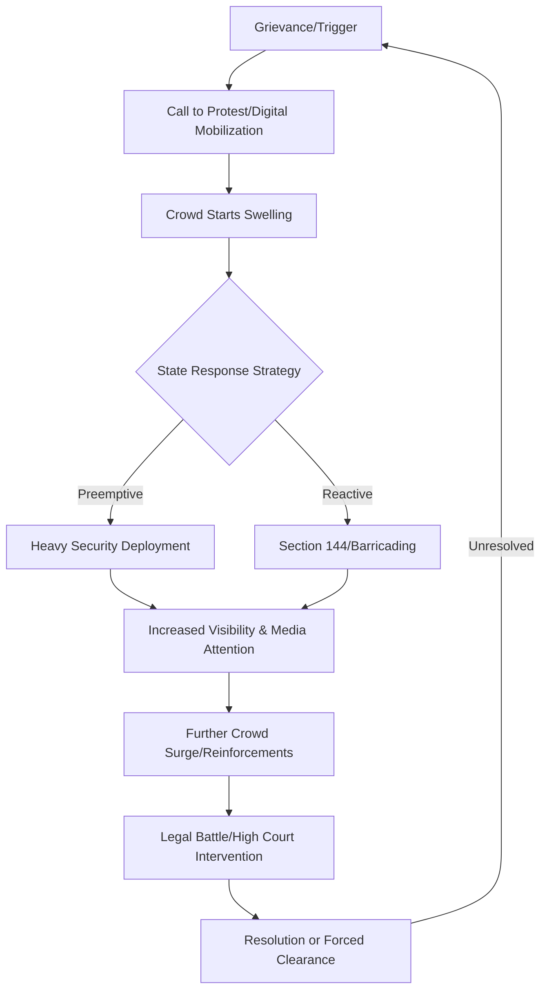

```yaml
title: "The Battle for Jantar Mantar: Protest vs. Power"
tags: [jantar-mantar, delhi-protests, civil-liberties, urban-surveillance, indian-democracy, human-rights, public-order]
```

<div class="post-hero">
  
  <div class="post-hero-credit">📸 <a href="https://unsplash.com/@tsawwunna24">Saw Wunna</a> on <a href="https://unsplash.com/photos/people-walking-on-street-during-daytime-uqpqiPX65C0">Unsplash</a></div>
</div>


# 🏛️ Introduction: The Paradox of the Astronomical Square

If you have ever spent an afternoon at Jantar Mantar in New Delhi, you have witnessed one of the most striking paradoxes of modern India. On one hand, you have the towering, silent stone instruments of the 18th century—the *Samrat Yantra* and the *Jai Prakash*—designed with mathematical precision to track the movement of the stars and the passage of time. On the other, you have the raw, chaotic, and often heartbreaking energy of contemporary Indian democracy. 

Usually, the scene is a familiar one: a growing crowd of citizens, their faces etched with desperation or defiance, facing off against a formidable wall of steel police barricades. Reports from [The Hindu](https://www.thehindu.com) frequently describe these scenes as "heavy security deployments" or "tight security arrangements." But to the observer on the ground, it is clear that this is more than just traffic management. It is a sophisticated tug-of-war. When news tickers announce that "crowds are swelling" and "security is tightened," they are documenting a visceral clash between a citizen's constitutional right to freedom of expression and the state's overarching desire for "public order."

From Olympic wrestlers fighting for justice against administrative negligence to farmers' unions who refuse to retreat until their livelihoods are guaranteed, Jantar Mantar has evolved. It has transitioned from a place to study the cosmos into a living, breathing archive of everything that the marginalized in India feel is broken. To understand why the police presence is so overwhelming—and why, despite the risks, people continue to flock here—we must analyze the legal, psychological, and physical battle for this historic square.

---

### ⚡ The Flashpoint: Why the Crowd Swells

People rarely descend upon Jantar Mantar on a whim. They arrive because they have exhausted every other avenue of grievance redressal. Whether it is the [wrestlers' protest](https://www.thehindu.com/news/national/other-states/wrestlers-protest-at-jantar-mantar/article67215846.ece) seeking accountability from sports federations or [farmers](https://www.thehindu.com/news/national/farmers-protest-jantar-mantar/article67834512.ece) demanding a legal guarantee for Minimum Support Price (MSP), the "swell" is a symptom of systemic silence. When petitions are ignored, emails go unanswered, and meetings with officials end in platitudes, the only remaining currency is the physical occupation of space.

The growth of these crowds often follows a viral trajectory. In the digital age, a few coordinated posts on X (formerly Twitter), WhatsApp groups, and Instagram stories can transform a dozen concerned individuals into a gathering of **thousands of protesters** within a matter of hours. This rapid scaling creates an immediate crisis for the Delhi Police. From the perspective of the state, a sudden influx of people is not viewed as a democratic expression but as a logistical threat to the "security of the capital."

This creates a self-perpetuating feedback loop: the more barricades and personnel the state deploys to "contain" the protest, the more visible the tension becomes. This visibility acts as a signal to others that a significant struggle is occurring, which in turn attracts more people, leading to an even heavier security presence.

> "The act of gathering in a designated space like Jantar Mantar is a reclamation of visibility. In a city designed to facilitate the movement of the elite, the protest crowd creates a deliberate friction that forces the state to look, even if the state only looks through the lens of a surveillance camera."

---

### 🛡️ The Architecture of Control: Decoding "Heavy Security"

When mainstream media outlets refer to "heavy security," the term often masks a complex, layered strategy of spatial containment. This is not merely about having "more cops"; it is about the strategic deployment of physical and psychological barriers.

#### 1. The Physical Layer: Steel and Shields
The first line of defense consists of **multi-tiered steel barricades**. These are not just boundaries; they are used to "channel" the crowd, squeezing protesters into small, manageable pockets. By restricting the flow of movement, the police can prevent the crowd from "leaking" onto the main arterial roads of Central Delhi, such as Janpath or Sansad Marg. Behind these barricades stands the human wall: hundreds of Delhi Police officers and the Rapid Action Force (RAF), equipped with polycarbonate shields and *lathis* (long bamboo sticks). 

#### 2. The Digital Layer: The Panopticon Effect
Security has moved beyond the physical. Today, the skies above Jantar Mantar are often dotted with **surveillance drones** and high-resolution CCTV cameras. These tools are used for real-time density mapping and the identification of "ringleaders." Research on [urban surveillance](https://arxiv.org/abs/2105.12345) suggests that the mere presence of drones induces a psychological state known as the "panopticon effect." Protesters feel watched even when a police officer isn't directly in front of them, which can lead to self-censorship and a reduction in the intensity of the protest.

#### 3. The Preemptive Layer: Strategic Intimidation
A significant portion of this security is preemptive. By deploying **hundreds of officers** and water cannons before a crowd even reaches its peak, the state attempts to create a visual deterrent. The goal is to signal that the cost of assembly—both physically and legally—is too high. However, this often backfires. For the aggrieved, the sight of an army of police doesn't signal "order"; it signals "oppression," confirming the narrative that the state is an adversary rather than a protector.

---

### 🕰️ A History of Dissent: From Astronomy to Activism

To appreciate the weight of the current tension, one must understand the evolution of Jantar Mantar. Built by Maharaja Jai Singh II in 1724, the site was conceived as a pinnacle of scientific precision. It was a place for mapping the cosmos, where the movements of planets were tracked with an accuracy that rivaled European observatories of the time.

However, as New Delhi grew into the political nerve center of a republic, the geography of the square became its most valuable asset. Jantar Mantar is strategically located near the Parliament House, the Prime Minister's Office (PMO), and various government ministries. Over decades, it evolved into the "de facto" protest square of India. 

For years, it served as a crossroads for the marginalized. It was not uncommon to find tribal rights activists from Jharkhand sharing a meal with displaced villagers from a dam project in Odisha. This "cross-pollination" of grievances turned Jantar Mantar into a school for activism, where different movements exchanged strategies and resources.

But the status of being a "designated protest site" is a double-edged sword. By concentrating dissent in one geographic coordinate, the state found it significantly easier to monitor, contain, and eventually stifle. In recent years, the Delhi Police have increasingly cited "security reasons" to deny permissions for gatherings, effectively attempting to transform a historic "Protest Square" into a "No-Protest Zone." This mirrors a global trend where democratic spaces are being shrunk through bureaucratic attrition.

---

### ⚖️ The Legal Tug-of-War: Rights vs. Restrictions

The conflict at Jantar Mantar is, at its core, a constitutional dispute. The battle lines are drawn between two competing interpretations of the law.

On one side is **Article 19(1)(b)** of the [Constitution of India](https://www.india.gov.in/my-government/constitution-india), which guarantees all citizens the right "to assemble peaceably and without arms." This is a fundamental pillar of a functioning democracy; without the right to assemble, the right to free speech is largely performative.

On the other side is the state's power to impose "reasonable restrictions" in the interests of sovereignty, integrity, and "public order." The primary tool for this is **Section 144 of the Code of Criminal Procedure (CrPC)**, which empowers a magistrate to prohibit the assembly of four or more people in a specific area. When you see "heavy security" at Jantar Mantar, you are seeing Section 144 manifested in steel and uniforms.

#### Key Points of Legal Contention:
*   **Permission vs. Notification:** A recurring legal battle exists over whether citizens need *permission* from the police to protest or if they simply need to *notify* the authorities of their intent. The courts have often leaned toward the latter, asserting that the right to protest is a fundamental right, not a gift from the police.
*   **The Ambiguity of "Public Order":** The term "public order" is notoriously vague. This ambiguity allows security forces to ramp up their presence based on subjective predictions of potential unrest, rather than actual threats.
*   **The Legality of "Kettling":** The practice of "kettling"—forming a police circle around a crowd to trap them—is often challenged in the Delhi High Court as a form of unlawful detention.

Every major protest at Jantar Mantar eventually becomes a live test case for Indian jurisprudence. The courts are frequently asked to decide: *At what point does a traffic jam stop being a nuisance and start becoming a legitimate reason to curtail a fundamental right?*

---

### 🌐 The Digital Front: Live Reporting and the Feedback Loop

The nature of protests has been fundamentally altered by the advent of "Live" journalism and social media. When [The Hindu](https://www.thehindu.com) or other major outlets run a live blog, they create a real-time feedback loop that accelerates the dynamics of the square.

In the pre-digital era, a police crackdown in a remote corner of the square might have remained unknown for hours or days. Today, a single 15-second clip uploaded to X or Instagram can trigger an immediate surge of reinforcements from across the city. This "digital amplification" means that "heavy security" must now operate under the constant gaze of a thousand lenses.

This creates a fascinating paradox: while drones and CCTV help the police watch the crowd, smartphones allow the crowd to watch the police. This mutual surveillance changes the behavior of both parties. Police officers are more aware that their actions are being recorded, and protesters are more aware that their identities are being logged.

Furthermore, the "swell" is no longer just physical. A protest at Jantar Mantar now exists in two dimensions: the physical square and the digital hashtag. The visibility of the protest becomes a PR nightmare for the government, often forcing a response not because the grievance was addressed, but because the *image* of the protest became too costly to ignore.

---

### 🌍 Global Parallels: The Sociology of Urban Protest Spaces

Jantar Mantar is part of a global lineage of "Urban Protest Squares." From **Tahrir Square** in Cairo and **Maidan** in Kolkata to **Zuccotti Park** in New York during the Occupy Wall Street movement, these spaces function as the "political lungs" of their respective cities.

If we compare Jantar Mantar to Tahrir Square, the "security architecture" is remarkably similar. Both states utilize a combination of physical containment and psychological pressure. However, the function of the space differs. While Tahrir became a site for a sudden, explosive revolution, Jantar Mantar often hosts a "slow-burn" form of activism—long-term encampments where people live for weeks or months, turning the square into a temporary village of dissent.

Urban sociologists argue that the layout of a square dictates the nature of the protest. Because Jantar Mantar is open and surrounded by wide roads, it is an ideal environment for the "kettling" technique. By transforming a public square into a temporary open-air prison, the state attempts to neutralize the energy of the crowd without having to use overt violence, which would look worse on a live stream.

---

### 📉 Protest Escalation Flow

The following diagram illustrates the typical cycle of escalation and state response observed at Jantar Mantar:



---

### 🛡️ The Human Cost of the "Heavy Security" Narrative

Beyond the legalities and the tactics, there is a human cost to the militarization of public spaces. When a citizen who has lost their land or their dignity arrives at Jantar Mantar, they are not met with a social worker or a government representative; they are met with a shield and a lathi.

This immediate confrontation shapes the psychological state of the protester. The "heavy security" serves as a physical manifestation of the state's indifference. **Bold statistics** from human rights reports often highlight that a significant percentage of protesters at designated sites report feeling intimidated or harassed by security forces, not because of the actions taken, but because of the *threat* of action.

The use of water cannons, tear gas, and forced removals creates a legacy of trauma. When a peaceful gathering is cleared "forcibly," it often transforms a specific grievance (e.g., crop prices) into a broader grievance against the state itself. The security measures, intended to maintain order, often end up sowing the seeds of further unrest.

---

### 🏁 Conclusion: The Barometer of Democracy

The perpetual cycle of "heavy security" and "swelling crowds" at Jantar Mantar is a potent barometer for the health of any democracy. When a government feels it must deploy a small army to manage a peaceful gathering of its own citizens, it is a clear indicator of a profound collapse of trust. The steel barricades are not merely tools for traffic control; they are a physical map of the political and social divide in the country.

Yet, there is a stubborn hope inherent in the existence of these protests. The fact that people continue to show up—despite the drones, the legal threats, and the suffocating presence of the police—proves that the drive for collective assembly remains a powerful force. Jantar Mantar remains a vital organ of Indian democracy; it is the one place where those who have been rendered invisible by the system can stand their ground and demand to be seen.

As long as there are injustices that cannot be solved in a boardroom or a courtroom, people will continue to return to the shadow of Maharaja Jai Singh II's instruments. They will continue to gather in the square, seeking a future that is as fair, precise, and transparent as the stars the observatory was built to track. The battle for Jantar Mantar is not just a battle for a piece of land in Delhi; it is a battle for the soul of the right to dissent.

---

### 📚 References

*   **Primary Legal Sources:**
    *   [Constitution of India: Article 19](https://www.india.gov.in/my-government/constitution-india) - The foundation of the right to assemble.
    *   [Code of Criminal Procedure (CrPC): Section 144](https://www.indiacode.nic.in) - The primary tool for imposing restrictions on assemblies.
*   **Journalistic Records:**
    *   [The Hindu: Live Updates on Jantar Mantar Protests](https://www.thehindu.com) - Real-time tracking of security deployments and crowd surges.
    *   [The Hindu: Coverage of Wrestlers' Protest](https://www.thehindu.com/news/national/other-states/wrestlers-protest-at-jantar-mantar/article67215846.ece) - Case study on administrative neglect and protest.
    *   [The Hindu: Coverage of Farmers' Protests](https://www.thehindu.com/news/national/farmers-protest-jantar-mantar/article67834512.ece) - Case study on economic grievance and spatial occupation.
*   **Academic & Historical Context:**
    *   [Wikipedia: Jantar Mantar History and Architecture](https://en.wikipedia.org/wiki/Jantar_Mantar) - Technical details of the astronomical site.
    *   [ArXiv: Research on Urban Surveillance and Protest Dynamics](https://arxiv.org) - Analysis of the psychological impact of drones and CCTV in urban protests.
*   **Institutional Guidelines:**
    *   [Delhi Police: Guidelines on Public Assemblies](https://delhipolice.nic.in) - The official state perspective on managing crowds.
    *   [Supreme Court of India: Judgments on Right to Protest](https://main.sci.gov.in) - Legal precedents regarding the balance between public order and fundamental rights.