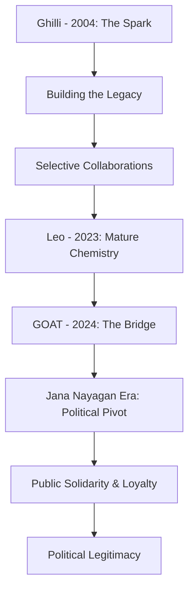

```yaml
title: "Trisha & Vijay: The Power Duo's Shift to Jana Nayagan Era"
tags: [tamil-cinema, vijay, trisha, jana-nayagan, tvk, kollywood, cinema-politics, goat-movie]
```

# 🌟 The Queen and the People's Leader: Trisha’s Big Moment at the Chennai Theatre for Vijay’s Latest

# 🎬 Movies, Chemistry, and Pure Charisma: Why Trisha Supporting Vijay’s 'Jana Nayagan' Era is a Big Deal

You know that feeling when two absolute icons cross paths? That’s exactly what happened in Chennai recently, and the energy was nothing short of electric. When the video of actress Trisha showing up at a theatre to support Vijay went viral, the internet didn't just react—it exploded. For the casual observer, it might look like a simple celebrity appearance, but for those embedded in the cultural fabric of Tamil Nadu, this was a symbolic passing of the torch.

If you're not familiar with the scene, this wasn't just some celebrity attending a premiere. It was a pivotal moment involving a decades-long friendship and a massive life transition for one of Asia's biggest stars. For years, the world has known him as 'Thalapathy' (the Commander), a title that signifies his dominance over the box office. However, he is now transitioning into a far more complex role: **Jana Nayagan** (the People's Leader). He is officially bridging the gap between the silver screen and the legislative assembly with the launch of his own political vehicle, [Tamilaga Vettri Kazhagam (TVK)](https://www.thehindu.com/news/national/tamil-nadu/vijay-launches-political-party-tamilaga-vettri-kazhagam/article68615432.ece).

Then you have Trisha. She is a legend in her own right, a powerhouse of talent who has navigated the treacherous waters of the film industry for over two decades. She and Vijay have shared an incredible on-screen shorthand that has defined the romantic aspirations of millions. Her showing up wasn't merely a professional courtesy; it was a public declaration of solidarity. Watching her step out of her car into a sea of cheering fans and flashing lights reminded everyone that while Vijay is heading toward the grit of politics, the bonds forged during the golden age of Tamil cinema remain unbreakable.

Let's dive deep into the viral moment that captured the public's imagination, the storied history between these two icons, and the sociological weight of the "Jana Nayagan" transition.

---

## 🚗 That Viral Arrival: A Masterclass in Star Power

The video of Trisha arriving at the theatre is more than just a clip; it is a lesson in the physics of stardom. From the second her car pulls up, the atmosphere shifts. All you can hear is the rhythmic chanting and the deafening roar of the crowd. These fans don't just see Vijay as an actor—to many, he is a messianic figure, a hero who represents their own aspirations. 

Trisha looked effortlessly elegant, maintaining a poise that only comes from years of being in the spotlight. The reception she received was almost as intense as the adoration usually reserved for the lead actor. This suggests that in the eyes of the fans, Trisha is not just a co-star; she is an integral part of the "Vijay Universe."

**Key Observations from the Viral Moment:**
*   **The Fan Energy:** The sheer volume of people lining the streets highlights the **"Thalapathy Effect."** It is estimated that during major releases, fan gatherings can swell to **tens of thousands** in a single locality, turning a movie premiere into a city-wide event.
*   **Trisha’s Poise:** Even amidst the chaos of screaming fans and aggressive paparazzi, she remained gracious. Her small waves and warm smiles are a testament to her professionalism and the genuine affection she holds for the fans.
*   **Strategic Timing:** This appearance coincided with the release of [The Greatest of All Time (GOAT)](https://www.timesofindia.indiatimes.com/entertainment/tamil/movies/reviews/the-greatest-of-all-time-movie-review/articleshow/113427124.cms), a film that served as a cinematic capstone to his acting career before his political pivot.

It didn't feel like a staged PR move. In an industry often criticized for manufactured "friendships" for the sake of marketing, this felt authentic. In a world of rivalries and ego clashes, seeing Trisha and Vijay support each other so openly is a refreshing reminder of the power of genuine loyalty.

---

## 🐐 The 'GOAT' Connection: Mirroring a Life Transition

The reason the crowds gathered was for *The Greatest of All Time* (GOAT), a film that pushed the boundaries of VFX and storytelling in the Tamil industry. In the film, Vijay plays a dual role, dealing with themes of identity, fatherhood, and the burden of duty. For the audience, the dual role served as a perfect metaphor for Vijay's current real-life state: the duality of being a cinematic idol and a burgeoning political leader.

The movie performed exceptionally well at the global box office, breaking multiple records in the first weekend. However, the real victory was the nostalgia. By bringing Trisha back to the screen, director Venkat Prabhu tapped into a collective memory. For a generation of viewers, Trisha and Vijay are the "Gold Standard" of chemistry—a pairing that feels natural, rhythmic, and timeless.

> "The chemistry between Vijay and Trisha is an institutional part of Tamil cinema. When they share the screen, it's not just about the plot; it's about a legacy of hits that defined a generation. Their reunion in GOAT isn't just casting; it's a cultural event."

Trisha's presence at the screening acted as a silent endorsement of Vijay’s evolution. *GOAT* functions as the bridge between his life as a superstar and his new image as a leader. Her support suggested that the deep connections he portrays on screen are mirrored in his actual life, providing him with the emotional social capital needed to enter the volatile world of politics.

---

## 🎞️ A History of Chemistry: From *Ghilli* to *Leo*

To understand why a simple video of an arrival can trend for days, one must analyze the trajectory of their partnership. It all began in earnest with the 2004 smash hit [Ghilli](https://en.wikipedia.org/wiki/Ghilli). This film didn't just break records; it redefined the "mass" movie formula in Tamil Nadu, blending high-octane action with a sparkling romantic subplot.

**The Evolution of the Duo:**

1.  **The Spark (*Ghilli* Era):** This was the era of high energy and youthful romance. Their interplay—characterized by playful bickering and intense chemistry—became the blueprint for romantic leads in the 2000s.
2.  **The Selective Reunions:** Unlike many pairs who overexpose themselves, Vijay and Trisha worked together selectively. This scarcity created a "hunger" among the fans. Every time they were announced for a project together, the hype reached a fever pitch.
3.  **The Mature Era (*Leo* and *GOAT*):** In [Leo (2023)](https://www.imdb.com/title/tt26612732/) and *GOAT*, the chemistry evolved. They transitioned from "young lovers" to a grounded, sophisticated partnership. This maturity mirrors the growth of their audience, who have grown up alongside them.

Their relationship is a rarity in Kollywood. Maintaining a close bond for **20+ years** in an industry known for volatility is a feat of character. When fans see Trisha supporting Vijay, they don't just see a colleague; they see a witness to his growth, from a struggling actor to a cultural phenomenon.



---

## 🏛️ From Movie Hero to People's Leader: The Political Jump

The most profound aspect of this narrative is Vijay’s transition from *Cinema Nayagan* (Hero of Cinema) to **Jana Nayagan** (People's Leader). This is not merely a rebranding exercise; it is a total shift in his life's trajectory. The launch of [Tamilaga Vettri Kazhagam (TVK)](https://www.newindianexpress.com/states/tamil-nadu/2024/Oct/13/vijay-tvk-first-state-conference-key-highlights.php) marks his official entry into the complex arena of Tamil Nadu politics.

In Tamil Nadu, the intersection of cinema and politics is not just common—it is the foundation of the state's political history. From the oratorical brilliance of C.N. Annadurai to the enduring legacies of MGR and Jayalalithaa, the path from the screen to the Secretariat is well-trodden. However, Vijay is attempting a modern iteration of this journey.

**Why the "Jana Nayagan" label is a strategic masterstroke:**
*   **Ideological Rebranding:** By moving away from "Thalapathy" (a title associated with military command and cinematic power) to "Jana Nayagan," he is signaling a shift toward servant-leadership. He is positioning himself not as a ruler, but as a representative.
*   **Converting Fandom into Cadre:** The "Vijay Army" is one of the most organized fan bases in the world. Converting these fan clubs into party wings is a logistical advantage that few traditional politicians possess. He is effectively turning **millions of fans** into potential voters.
*   **The Humanization Factor:** This is where Trisha’s support becomes vital. Politics can often strip a person of their humanity, turning them into a series of slogans and policies. Trisha, as a lifelong friend, humanizes him. Her presence reminds the public that the "People's Leader" is still the same person who is loved and respected by his peers.

The viral video of her arrival is, in many ways, a political symbol. It showcases Vijay in a state of transition—still enveloped in the glamour of cinema, but preparing for the grit and scrutiny of governance.

---

## 🍿 The Sociology of 'Thalapathy' Fever in Chennai

To an outsider, the frenzy at a Chennai movie theatre might seem like hysteria. But to understand this, one must understand that in Tamil Nadu, cinema is a primary source of social and political identity. The "First Day First Show" (FDFS) culture is less like a movie outing and more like a religious pilgrimage.

**The Rituals of the FDFS:**
*   **Paal Abhishekham:** The practice of pouring milk over massive cardboard cut-outs of the actor.
*   **The Noise Floor:** The use of crackers, confetti, and high-decibel cheering that can be heard for blocks.
*   **Community Bonding:** The theatre becomes a space where social hierarchies disappear, and everyone is united by their shared adoration for the star.

When Vijay enters this space, he isn't just a celebrity; he is the center of a cultural ecosystem. Adding Trisha to the mix creates a "Super-Event." It validates the fans' passion and elevates the movie from a piece of entertainment to a historical marker.

**What drives this obsession?**
1.  **The Underdog Narrative:** Vijay's rise—from early career struggles to becoming the highest-paid actor in the state—mirrors the dreams of millions of young people in Tamil Nadu.
2.  **The 'Mass' Aesthetic:** In Kollywood, "Mass" refers to a specific type of larger-than-life heroism. Vijay has perfected this, and the crowd's reaction is the real-world manifestation of that cinematic energy.
3.  **Loyalty Loops:** The fans feel a deep sense of loyalty to Vijay, and in turn, they reward that loyalty with an intensity that is rarely seen in other industries.

---

## 👑 Trisha's Own Power: The Queen of Longevity

While the spotlight often focuses on the male lead, it is imperative to recognize Trisha's own standing. She is not merely a "heroine" in the traditional sense; she is a survivor and a strategist who has remained at the top of a notoriously ageist industry for over two decades.

**The Trisha Analysis:**
*   **Career Versatility:** From the bubbly roles of her youth to her nuanced performance in the [Ponniyin Selvan](https://en.wikipedia.org/wiki/Ponniyin_Selvan:_I) series, she has demonstrated an ability to evolve. She has transitioned from being a romantic interest to a powerhouse performer.
*   **Cultural Influence:** Trisha represents a brand of grace and intelligence. Her ability to maintain her relevance while avoiding the typical scandals of the industry has made her a role model for many.
*   **The Pillar of Support:** Her relationship with Vijay is a cornerstone of her public image. In an industry where alliances are often transactional, her unwavering support for him is viewed as a sign of genuine character.

By appearing at the *GOAT* screening, Trisha reminded the industry that she is a pillar of the establishment. She wasn't just supporting a friend; she was asserting her position in the current era of cinema. If Vijay is the "Jana Nayagan," Trisha is the "Queen" whose presence lends an air of legitimacy and class to the proceedings.

---

## 🎯 Final Analysis: The Synergy of Two Icons

The viral video of Trisha arriving at the theatre is far more than a celebrity sighting. It is a snapshot of a monumental shift in the cultural landscape of South India. In those shared glances and the roar of the crowd, we see the intersection of twenty years of cinematic history and the dawn of a new political chapter.

Vijay’s journey toward becoming a successful **Jana Nayagan** will be fraught with challenges. The transition from the controlled environment of a movie set to the chaotic reality of the state assembly is rarely smooth. He will face opposition from established political giants and the relentless scrutiny of the press.

However, the support of figures like Trisha provides him with something that cannot be bought: **authentic loyalty**. In politics, loyalty is the ultimate currency. The image of Trisha and Vijay together remains a powerful testament to the fact that while titles change—from actor to leader, or co-star to ally—genuine human connection is the most enduring "hit" of all.

Chennai didn't just witness a movie premiere that day; they witnessed the consolidation of a legacy. As *The Greatest of All Time* concludes its theatrical run and the focus shifts to the TVK rallies, the memory of that arrival will linger. It serves as a reminder that leadership is not just about policies and platforms—it is about the people who stand by you when the lights fade and the real work begins.

---

## 📚 References & Further Reading

*   **The Hindu:** [Vijay launches political party Tamilaga Vettri Kazhagam](https://www.thehindu.com/news/national/tamil-nadu/vijay-launches-political-party-tamilaga-vettri-kazhagam/article68615432.ece) - Detailed report on the ideological foundation of TVK.
*   **Times of India:** [The Greatest of All Time (GOAT) Movie Review](https://www.timesofindia.indiatimes.com/entertainment/tamil/movies/reviews/the-greatest-of-all-time-movie-review/articleshow/113427124.cms) - Analysis of the film's technical achievements and narrative.
*   **Wikipedia:** [Ghilli (Film)](https://en.wikipedia.org/wiki/Ghilli) - The 2004 film that established the Vijay-Trisha pairing.
*   **IMDb:** [Leo (2023) Movie Details](https://www.imdb.com/title/tt26612732/) - Credits and reception for the 2023 reunion.
*   **New Indian Express:** [Vijay TVK First State Conference Highlights](https://www.newindianexpress.com/states/tamil-nadu/2024/Oct/13/vijay-tvk-first-state-conference-key-highlights.php) - Key takeaways from the party's inaugural conference.
*   **Wikipedia:** [Vijay (Actor) Profile](https://en.wikipedia.org/wiki/Vijay_(actor)) - Comprehensive biography of the actor's career.
*   **Wikipedia:** [Ponniyin Selvan: I](https://en.wikipedia.org/wiki/Ponniyin_Selvan:_I) - Context on Trisha's evolution into high-budget historical dramas.
*   **NDTV News:** [Tamil Nadu Political Trends](https://www.ndtv.com) - General tracking of cinema-to-politics transitions in the region.