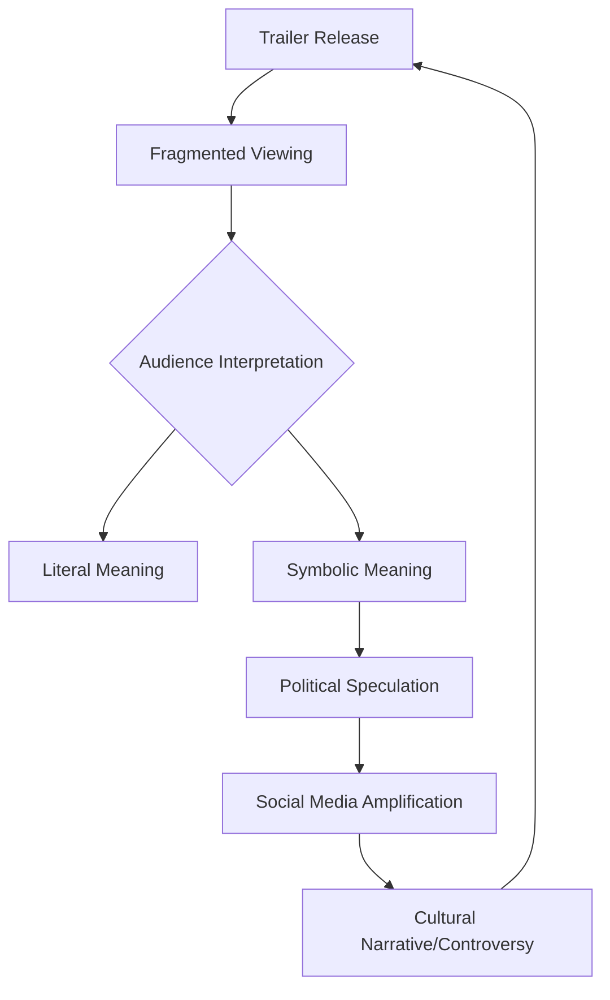

```yaml
title: "Decoding the Ramayana: Cinema, Culture, and the Art of Speculation"
tags: [indian-cinema, ramayana, film-semiotics, cultural-analysis, digital-folklore, movie-marketing, socio-politics]
```

# 🎬 The Cinematic Ramayana: Mythology, Politics, and the Art of Speculation

The announcement of a high-budget, modern cinematic adaptation of the *Ramayana* is never merely a piece of entertainment news in the Indian subcontinent. It is a cultural event that triggers a complex intersection of faith, national identity, and artistic expectation. When a trailer or a teaser for such a project is released, the audience does not simply watch it—they decode it. In an era of hyper-connectivity and political polarization, every frame is scrutinized for "hidden messages," turning a marketing tool into a Rorschach test for the viewer's own socio-political anxieties.

The *Ramayana*, as an epic, provides a moral and ethical blueprint for millions. Consequently, any visual representation of Rama, Sita, or Hanuman carries an immense burden of representation. When modern filmmakers approach this text, they are not just battling the technical challenges of VFX but are navigating a minefield of cultural sensitivity and contemporary interpretation.

## 📜 The Eternal Narrative: Why Ramayana Matters

<div class="post-hero">
  
  <div class="post-hero-credit">📸 <a href="https://unsplash.com/@ankitgirwal">Ankit Girwal</a> on <a href="https://unsplash.com/photos/a-man-sitting-next-to-a-woman-near-a-body-of-water-2_CRVpWa7Gs">Unsplash</a></div>
</div>


To understand why a movie trailer can spark intense speculation, one must first understand the gravity of the source material. The [Ramayana](https://en.wikipedia.org/wiki/Ramayana) is not a static text; it is a living tradition. From the classical Sanskrit verses of Valmiki to the soulful devotion of Tulsidas's *Ramcharitmanas*, the story has been adapted across centuries and borders, influencing art in Thailand, Indonesia, and Cambodia.

In India, the 1987 television series produced by Ramanand Sagar set a gold standard for visual iconography. For decades, the image of Rama was inextricably linked to the actors of that era. A new cinematic version seeks to redefine this iconography for a Gen Z and Millennial audience. This transition creates a vacuum of meaning that the audience often fills with their own contemporary concerns.

## 🎥 The Trailer as a Cultural Catalyst

In the modern film industry, the "trailer" has evolved from a simple preview into a strategic psychological tool. Filmmakers use specific colors, sonic cues, and rapid-fire editing to create an emotional resonance before the story even unfolds. In the context of a project as massive as the *Ramayana*, the trailer serves as a manifesto.

When a trailer is released, the discourse typically splits into three tiers:
1. **The Aesthetic Tier**: Focuses on the CGI, costume design, and casting.
2. **The Devotional Tier**: Analyzes the faithfulness of the adaptation to the scripture.
3. **The Speculative Tier**: Searches for subtexts, allegories, and "hidden messages" that reflect current events.

It is in this third tier where the most fascinating—and often most unfounded—theories emerge.

## 🔍 The Speculation Engine: Hidden Messages and Political Projection

A recurring phenomenon in modern cinema is the "Easter Egg" culture. Audiences, trained by the Marvel Cinematic Universe (MCU), now expect every frame to contain a clue about a future plot point or a hidden meaning. When this habit is applied to a culturally charged epic like the *Ramayana*, the speculation often shifts from plot points to political statements.

For example, in a climate of heightened socio-political tension, some viewers may attempt to link visual metaphors in a trailer to contemporary struggles, such as student protests or civic unrest. They might interpret a specific shot of a crowd, a choice of attire, or a particular line of dialogue as a coded signal of support or critique regarding current events.

> "The act of seeking hidden political messages in art is often less about the artist's intent and more about the viewer's need to see their own reality reflected in the narratives they consume." — *Analysis of Contemporary Media Semiotics*

It is crucial to note that these interpretations are frequently a result of **Confirmation Bias**. When an individual is deeply invested in a political cause, their brain is primed to recognize patterns that support their belief system. If a viewer believes that cinema should be a tool for activism, they will "find" activism in the frames, even if the director's only intention was to create a visually stunning shot of a forest.

## 📉 The Mechanics of Digital Folklore

The journey from a three-minute trailer to a widespread conspiracy theory about "hidden messages" is accelerated by the architecture of social media. Platforms like X (formerly Twitter), Reddit, and WhatsApp create echo chambers that amplify speculative readings.

### The Cycle of Speculation
The process typically follows a predictable pattern, as illustrated in the diagram below:



1. **Fragmented Viewing**: Viewers pause and screenshot specific frames, stripping them of their original context.
2. **Symbolic Meaning**: A color or object is assigned a modern political meaning (e.g., a specific shade of saffron or blue).
3. **Political Speculation**: The symbol is linked to a current event, such as student activism.
4. **Amplification**: The theory is shared within a community of like-minded individuals, where it is validated and expanded.
5. **Narrative Formation**: The speculation becomes a "fact" within that digital bubble, regardless of whether the filmmakers ever intended such a message.

## 🛠️ Semiotic Analysis: Reading Between the Frames

Semiotics is the study of signs and symbols and their use or interpretation. In film, a "sign" consists of the **signifier** (the actual image) and the **signified** (the concept it represents). 

In a *Ramayana* trailer, a signifier might be a flickering lamp. To a devotee, the signified is "hope" or "divine presence." To a political theorist, it might be the "spark of revolution." The disconnect between the creator's signified and the viewer's signified is where the "hidden message" discourse resides.

**Bold Statistics on the Impact of Digital Media in India:**
*   **1.4 Billion**: The approximate population of India, creating one of the world's largest potential audiences for a *Ramayana* adaptation.
*   **600+ Million**: The estimated number of active internet users in India, fueling the rapid spread of cinematic speculation.
*   **$2.5 Billion**: The approximate valuation of the Indian film industry, making high-stakes marketing essential.
*   **85%**: The percentage of urban youth who consume movie trailers via short-form video platforms (TikTok/Reels/Shorts), which further fragments the narrative.

## 🏛️ The Intersection of Art and Activism

The tendency to look for political signals in the *Ramayana* is not an isolated incident. Indian cinema has a long history of using allegory to bypass censorship or to speak to the masses. From the subtle critiques in the works of Satyajit Ray to the overt political themes in modern "masala" movies, the line between entertainment and activism has always been thin.

However, there is a fundamental difference between **intentional allegory** (where the filmmaker consciously embeds a message) and **perceived allegory** (where the audience projects a message). When audiences claim a trailer contains "hidden messages" about student protests without evidence, they are engaging in a form of collective storytelling. They are essentially rewriting the movie in their heads to make it more relevant to their current struggles.

## 🏁 Conclusion: The Mirror of the Audience

The *Ramayana* is a story of dharma, duty, and the triumph of light over darkness. In its cinematic rebirth, it becomes more than just a retelling of an ancient tale; it becomes a mirror. When people search for hidden messages about protests, politics, or social upheaval within its frames, they are not necessarily uncovering the secrets of the director—they are revealing the preoccupations of the age.

Whether the upcoming film is a traditional retelling or a modern reimagining, its success will not just be measured by the box office, but by how it navigates the treacherous waters of public perception. In the end, the most powerful "hidden message" in any piece of art is the one the viewer brings with them to the theater.

***

### 📚 References & Further Reading

**Industry & Cultural Context:**
*   **IMDb**: [Explore Ramayana adaptations in Cinema](https://www.imdb.com/find?q=ramayana)
*   **Variety**: [The Evolution of the Indian Blockbuster](https://variety.com)
*   **The Hindu**: [Analysis of Indian Epic Narratives in Modern Media](https://www.thehindu.com)

**Theoretical Frameworks:**
*   **Stanford Encyclopedia of Philosophy**: [Introduction to Semiotics and Meaning](https://plato.stanford.edu)
*   **Wikipedia**: [The Ramayana Epic and its Global Influence](https://en.wikipedia.org/wiki/Ramayana)

**Data & Trends:**
*   **Statista**: [Internet Penetration and Social Media Usage in India](https://www.statista.com)
*   **Indian Express**: [Entertainment Trends and Audience Psychology](https://indianexpress.com)
*   **Times of India**: [Box Office Analysis of Mythological Films](https://timesofindia.indiatimes.com)