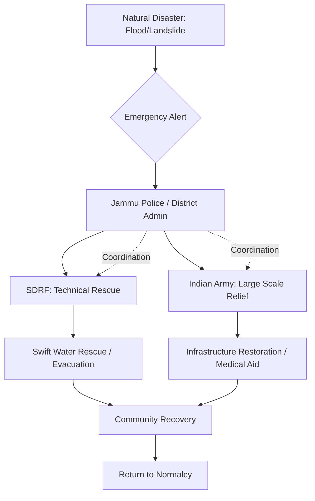

```yaml
title: "Braving the Current: J&K's Monsoon Rescue Operations"
tags: [jammu-kashmir, disaster-management, indian-army, sdrf, monsoon-relief, tawi-river, rescue-operations, climate-resilience]
```

# 🌊 The Monsoon’s Fury and the Fight to Save Lives

Monsoon season in Jammu and Kashmir is a study in contradictions. To the casual observer, the rain transforms the Shivalik hills into a lush, emerald paradise, draping the landscape in a mist that feels otherworldly. However, for those living on the edge of these slopes or near the riverbanks, the rain brings a visceral sense of dread. In a matter of minutes, a placid stream can mutate into a deadly torrent, and a seemingly stable hillside can liquefy, triggering a landslide that swallows entire road networks.

Recently, this duality played out in a series of high-stakes emergencies. In the heart of Jammu city, the Tawi River—typically the city's lifeline and a site of spiritual gathering—became a scene of chaos when a sudden surge of water swept away two individuals. Simultaneously, in the rugged terrains of Reasi and Rajouri, the geography turned hostile as flash floods and massive landslides severed the connection between remote villages and the rest of the world.

These incidents are not isolated events; they are symptoms of a larger regional vulnerability. They highlight the critical necessity of a synchronized response mechanism where the Jammu Police, the State Disaster Response Force (SDRF), and the Indian Army operate as a single, cohesive unit. In the face of nature's unpredictability, the word of the hour has been **resilience**, backed by rigorous training and strategic deployment.

---

### 🚣 The Tawi Tussle: A Race Against the Current

The Tawi River, a major tributary that eventually feeds into the Chenab, is notorious for its volatility during the monsoon. Its behavior is largely dictated by the weather patterns in the mountains of Himachal Pradesh. When heavy precipitation occurs in the upper reaches, the Tawi experiences "flashy" behavior—water levels can rise with terrifying speed, catching residents and tourists off guard.

In the most recent crisis, two individuals were caught in a sudden surge. The current was not merely fast; it was turbulent, filled with sediment and debris that acted like battering rams against anything in its path. The [Jammu Police](https://www.jkpolice.gov.in/) were the first on the scene. While the police are trained in general emergency response, the Tawi's velocity during a surge makes a shore-based rescue nearly impossible. Attempting to enter the water without specialized gear would have likely resulted in more casualties.

The arrival of the State Disaster Response Force (SDRF) shifted the tide. The SDRF deployed elite swift-water rescue divers and high-powered inflatable rafts designed to navigate Class III and IV rapids. Witnesses described a scene of auditory chaos; the roar of the river was so overwhelming that verbal communication was impossible, forcing the rescuers to rely on hand signals and pre-planned tactical movements.

**The severity of the situation was underscored by the stats: water levels had surged by over 4 feet in a window of less than three hours**, creating a hydraulic jump that pushed victims downstream with immense force. Using a sophisticated "rope-and-boat" tethering system, which prevents the raft from being swept away while divers reach for victims, the team managed to secure the two individuals. Both were clinging to riverine vegetation and floating debris, exhausted and drifting toward more dangerous rapids. Upon extraction, they were immediately treated for shock and hypothermia—a common risk even in summer due to the freezing temperatures of mountain runoff.

---

### 🛡️ The Mechanics of Synergy: How SDRF and Police Integrate

The successful rescue in the Tawi River was not a fluke of luck but the result of a structured operational framework. The SDRF functions as the specialized tactical arm of the state's disaster apparatus, mirroring the protocols of the [National Disaster Response Force (NDRF)](https://ndrf.gov.in/).

When a water-based emergency is reported, the "Combined Response Protocol" is activated:

1. **The Perimeter Phase (Police)**: The local police act as the first responders. Their primary role is "Containment and Intelligence." They secure the riverbanks to prevent crowds from interfering with the rescue and provide the SDRF with precise "Last Seen Points" (LSPs) of the victims.
2. **The Technical Phase (SDRF)**: The SDRF brings the specialized hardware. This includes motorized outboard rafts, high-visibility life jackets, and "throw bags"—weighted ropes used to pull victims toward the shore from a distance.
3. **The Tactical Block**: Rescuers implement an "Upstream-Downstream Blockade." While the primary team attempts the rescue at the site of the incident, a secondary "catch team" is positioned several hundred meters downstream. This ensures that if a victim is swept past the first team, they are not lost to the river.

> "The synergy between the civil police and the SDRF is the cornerstone of disaster management in Jammu. One provides the reach and local knowledge, the other provides the specialized technical skill required to survive in high-velocity currents."

Beyond the hardware, the human element is forged through constant simulation. These teams engage in "dry-runs" during the winter months, practicing knot-tying, river reading (identifying eddies and boils), and casualty evacuation. This transition from a reactive posture to a proactive "rescue-first" strategy has significantly lowered the mortality rate during Jammu's annual floods.

---

### ⛰️ Chaos in the Hills: The Reasi and Rajouri Crisis

While the Tawi rescue was a concentrated, urban operation, the situation in Reasi and Rajouri was a systemic collapse of infrastructure. These districts are characterized by steep gradients and highly unstable geological formations. During the monsoon, these areas become hotspots for "mass wasting"—the geomorphic process where soil, regolith, and rock move downslope under the influence of gravity.

In Reasi, the devastation was marked by massive rockfalls. Boulders the size of small SUVs crashed onto primary highways, creating impassable blockades. In Rajouri, the crisis manifested as flash floods in "nullahs" (seasonal streams). These streams, which remain dry for most of the year, suddenly transformed into raging rivers, undermining the foundations of homes and wiping out retaining walls.

The impact was comprehensive: **critical road arteries were severed, power transmission lines were snapped, and cellular communication vanished in high-altitude pockets**. This created "dark zones" where the district administration had no way of knowing the extent of the casualties or the needs of the trapped populations.

The science behind this instability is rooted in "pore-water pressure." The soil in the Lesser Himalayas is often composed of fragmented sedimentary rocks and loose colluvium. When torrential rain saturates this soil, the water fills the gaps between particles, increasing the internal pressure and reducing the friction that holds the slope together. Once a critical threshold is reached, the entire slope fails, resulting in the devastating landslides witnessed in Reasi.

---

### 🪖 The Indian Army’s HADR Operations

When the scale of the disaster in Reasi and Rajouri exceeded the capacity of the district administration, the Indian Army was called upon to lead Humanitarian Assistance and Disaster Relief (HADR) operations. The Army’s involvement is a unique aspect of J&K's security architecture; because troops are already stationed in remote border posts, they are often the only organized force capable of reaching "cut-off" zones within the first "Golden Hour" of a disaster.

The Army's strategy focused on a three-pronged approach: **Connectivity, Care, and Comfort**.

#### 1. Restoring Connectivity
The Army Engineers (Corps of Engineers) deployed heavy earth-moving equipment, including excavators and dozers, to clear landslide debris. This was not merely about road repair; it was about reopening "lifeline routes." In many cases, the Army constructed temporary "Bailey bridges" or improvised crossings to ensure that supply trucks carrying food and medicine could reach isolated hamlets.

#### 2. Emergency Medical Intervention
Post-flood environments are breeding grounds for water-borne diseases and trauma injuries. The Army established "Forward Medical Posts" in the heart of the affected zones. These camps provided:
- **Trauma Care**: Immediate treatment for crush injuries resulting from landslides.
- **Preventative Medicine**: Distribution of chlorine tablets for water purification and medications to prevent outbreaks of cholera and dysentery.
- **Psychological Support**: Basic counseling for families who had lost their homes or livelihoods.

#### 3. Logistics of Survival
In areas where roads remained blocked for days, the Army utilized a combination of foot patrols and specialized all-terrain vehicles (ATVs). They distributed "Survival Kits" containing high-calorie food packets, clean drinking water, and thermal blankets. This logistical agility is a result of the Army's expertise in mountain warfare, which translates seamlessly into mountain rescue.

---

### 🗺️ The Geography of Risk: Analyzing the Vulnerability

To understand why these regions are so prone to disaster, one must look at the hydrological and geological map of the region. The [Tawi River](https://en.wikipedia.org/wiki/Tawi_River) basin is an example of a high-energy fluvial system. Because the river drains a vast area of the Himachal mountains, it carries a massive sediment load. During heavy rains, this sediment increases the water's density and destructive power, making it far more dangerous than a clear-water stream.

In the Reasi-Rajouri belt, the risk is compounded by "Slope Instability." The region is dominated by fragmented sedimentary rocks that are prone to weathering. Several factors exacerbate this natural vulnerability:
- **Deforestation**: The removal of indigenous tree cover for agriculture or construction has stripped the slopes of their natural anchors. Tree roots act as biological "rebar," holding the soil together; without them, the soil is easily washed away.
- **Unplanned Urbanization**: The construction of heavy concrete structures on fragile slopes increases the "surcharge load," making the land more likely to slide.
- **Cloudbursts**: The region is increasingly seeing "cloudburst" events—extreme precipitation in a small area over a short time. These events trigger immediate, violent flash floods that leave no time for evacuation.

The interaction between these factors creates a "compounding disaster" scenario, where a landslide blocks a river, creating a temporary dam that eventually bursts, sending a wall of water downstream into populated areas.

---

### 🤝 The Synergy of Salvation: Civil-Military Coordination

The response to the Tawi and Reasi/Rajouri crises demonstrates a sophisticated model of "Combined Operations." Disaster management in J&K is not a top-down mandate but a collaborative network.



The operational hierarchy is typically led by the Deputy Commissioner (DC) of the respective district, who acts as the incident commander. The roles are delineated to avoid redundancy:
- **Jammu Police**: Focus on crowd control, traffic management for rescue vehicles, and initial search-and-rescue intelligence.
- **SDRF**: Focus on "surgical" interventions—diving, rope rescue, and extracting people from collapsed structures.
- **Indian Army**: Focus on "heavy-lift" logistics—clearing roads, deploying helicopters for aerial surveys, and providing large-scale medical support.

This model is essential because J&K operates in a "high-threat environment." The Army's ability to integrate with civil authorities ensures that the region can handle both security challenges and natural disasters simultaneously without the system collapsing.

---

### 🌅 Lessons from the Torrent: Toward a Resilient Future

The rescue of two lives from the Tawi and the restoration of roads in Reasi and Rajouri are triumphs of human bravery and coordination. However, they also serve as a warning. As climate change alters precipitation patterns, the "once-in-a-decade" flood is becoming a "once-in-a-year" event.

To move beyond the cycle of "disaster and rescue," the region must invest in structural and systemic resilience:
- **Early Warning Systems (EWS)**: Installing automated river-level sensors in the Himachal highlands that can send real-time alerts to Jammu city before the surge arrives.
- **Slope Stabilization**: Implementing "bio-engineering" techniques, such as planting deep-rooted native grasses and installing retaining gabions to prevent landslides.
- **Zoning Laws**: Strict enforcement of building codes to prevent the construction of homes in high-risk "flood-plain" or "landslide-prone" zones.

The bravery of the SDRF divers and the Indian Army soldiers is commendable, but the ultimate goal should be a landscape where such bravery is not required because the people are safe.

As the monsoon clouds recede and the rivers return to their banks, the bond between the protectors and the community remains the strongest asset of the region. The collective experience of these crises has forged a blueprint for survival—one based on the belief that no matter how violent the current, there is always a hand reaching out to pull you to safety.

---

## 📚 References

- [Jammu & Kashmir Police Official Website](https://www.jkpolice.gov.in/) - Primary source for police mobilization and initial response protocols.
- [National Disaster Response Force (NDRF)](https://ndrf.gov.in/) - Guidelines on swift-water rescue and technical disaster response standards.
- [Wikipedia: Tawi River](https://en.wikipedia.org/wiki/Tawi_River) - Hydrological data and geographical basin information.
- [Indian Army Official Portal](https://indianarmy.nic.in/) - Overview of Humanitarian Assistance and Disaster Relief (HADR) operations in India.
- [JK State Disaster Management Authority](https://sdma.jk.gov.in/) - State-level disaster risk reduction frameworks and guidelines.
- [Greater Kashmir](https://www.greaterkashmir.com/) - Field reports on the Tawi river rescue and community impact.
- [Daily Excelsior](https://www.dailyexcelsior.com/) - Local reports on landslide impact and Army relief efforts in Rajouri and Reasi.
- [International Journal of Disaster Risk Reduction](https://www.sciencedirect.com/) - Academic context on Himalayan slope stability and monsoon-induced landslides.