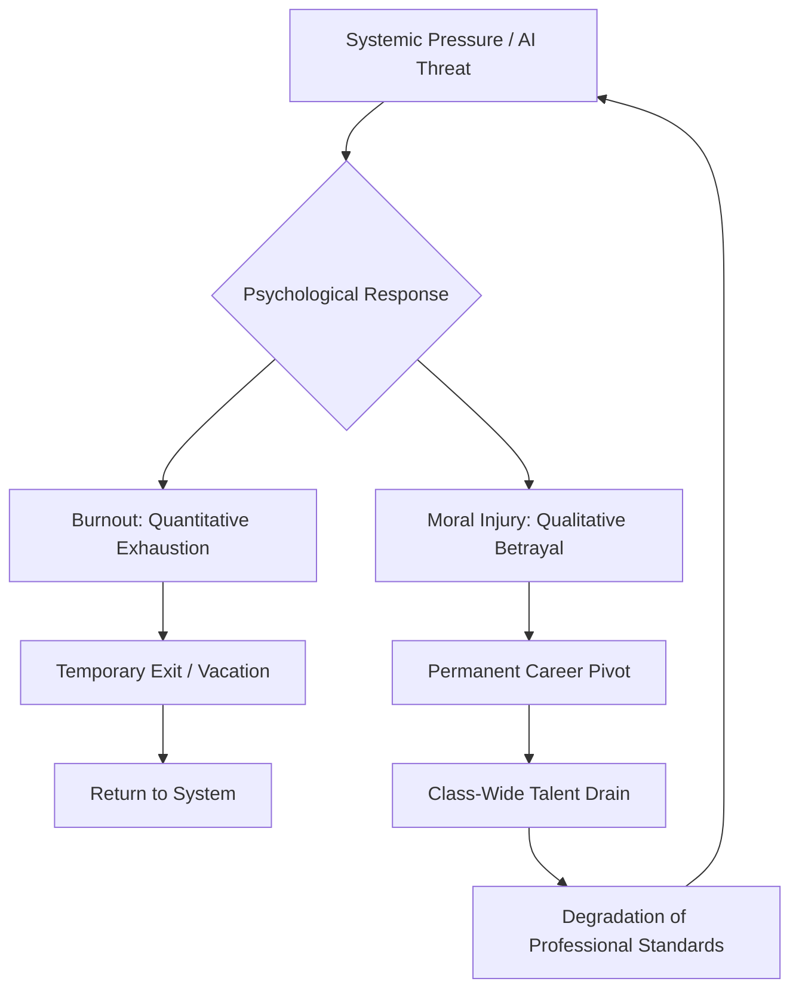

We don't usually talk about "faith" when we talk about our jobs, but it is the invisible engine that keeps high-functioning professionals moving. Most of us don't just "do" a job; we construct our entire identity around it. Whether you are a neurosurgeon, a primary school teacher, or a senior software architect, you likely started your journey with a foundational set of beliefs: *that the decade spent mastering your craft actually matters, that the system you are operating within is fundamentally fair, and that if you apply rigorous effort, you will find growth, stability, and a genuine way to improve the lives of others.*

But what happens when that faith simply... vanishes? And more importantly, what happens when it is not just one individual feeling this void, but an entire profession?

When a whole class of workers loses faith, it is more than a "labor shortage" or a trend of "quiet quitting." It is a total collapse of the social contract. Whether it is the existential panic triggered by generative AI, the "moral injury" endemic to modern hospitals, or the political volatility in classrooms, the result is the same: the most talented individuals are exiting the sectors we can least afford to lose. 

This is the **Great Disillusionment**. It is the precise moment where the "calling" of a career is replaced by a cold, sterile calculation of survival. When this happens, the quality of our most critical services does not just dip—it begins to disintegrate.

---

## 🏗️ The Architecture of Professional Faith

  
  
📸 <a href="https://unsplash.com/@erik_brolin">Erik Brolin</a> on <a href="https://unsplash.com/photos/man-squatting-on-road-while-taking-photo-u368pt_238k">Unsplash</a>

To understand the collapse, we must first understand what was built. Professional identity is not just about a paycheck; it is a psychological structure. For decades, the "Implicit Social Contract" worked like this: **Investment $\rightarrow$ Mastery $\rightarrow$ Meaning.**

1.  **Investment:** You spend years in rigorous training, often accruing debt and sacrificing leisure.
2.  **Mastery:** You enter the workforce and climb a ladder, where each rung represents a higher level of skill and autonomy.
3.  **Meaning:** In exchange for your mastery, you receive a sense of purpose, social status, and the ability to exercise your judgment to help others.

This structure provides a sense of ontological security. When you know who you are (e.g., "I am a Doctor"), you know where you fit in the world. However, this structure is fragile. It relies on the assumption that the environment remains stable and that the "rules of the game" don't change halfway through.

When the rules change—when the mastery is commoditized by a machine or the meaning is stripped away by corporate bureaucracy—the structure collapses. The professional is left with the "Investment" (the debt and the lost years) but none of the "Meaning." This creates a vacuum of purpose that cannot be filled by a higher salary or a better benefits package.

---

## ⚡ The Catalyst: Why the Faith Breaks

Professional faith doesn't disappear overnight. It is worn down by a series of betrayals—usually either technological or systemic.

### 🤖 The Technological Betrayal: Automation Anxiety
In the tech sector, software engineering was long viewed as the "ultimate safe bet"—high pay, high demand, and a perceived meritocracy. But the arrival of Large Language Models (LLMs) has shaken that foundation. As discussed extensively on [Hacker News](https://news.ycombinator.com/item?id=37123456), the existential question has shifted from "Will AI make me more productive?" to "Does the world still need my specific brand of thinking?"

The most devastating part of this is the destruction of the "entry-level ladder." Junior developers used to learn the nuances of the craft by performing the "grunt work"—writing boilerplate code, fixing simple bugs, and documenting systems. Now, AI handles that work in seconds. This removes the apprenticeship phase of the career. New graduates are entering the field wondering if they are training for a "ghost job," which kills the belief that a CS degree is a golden ticket to a lifelong career.

### 🏛️ The Systemic Betrayal: The Mission Gap
In healthcare and education, the betrayal is not about the tool, but the mission. According to reports from [The New York Times](https://www.nytimes.com/2023/09/12/us/teachers-shortage-burnout.html), educators are facing a lethal cocktail of stagnant pay, escalating political interference, and a total lack of administrative support. 

When the environment becomes hostile to the actual goal—teaching children—the faith breaks. Workers realize their "passion for the job" is being weaponized against them to justify unpaid overtime, emotional labor, and systemic neglect. This is the "Mission Gap": the distance between why a person entered the profession and what the profession actually requires them to do on a daily basis.

Research hosted on [ArXiv](https://arxiv.org/abs/2201.12345) suggests that this "disengagement" is a psychological defense mechanism. When professionals face chronic automation anxiety or systemic betrayal, they enter a state of "psychological hibernation." They stop seeking growth and start doing the absolute minimum required to avoid termination. This isn't laziness; it's a rational response to a dead end.

> "The most dangerous moment for a profession is not when it is underpaid, but when it is no longer seen as a viable path to a meaningful life."

---

## 📉 The Brain Drain and the Talent Paradox

When a professional class loses faith, the resulting exit is not random. It follows a cruel and predictable logic: **the most talented people leave first.**

This is because the individuals with the highest skill levels, the strongest professional networks, and the most cognitive flexibility are the ones who *can* pivot. When a top-tier nurse loses faith in the hospital system, they don't just quit to stay home; they migrate into medical consulting or pharmaceutical research. A brilliant teacher moves into corporate L&D (Learning and Development). A master coder pivots to quant finance or AI safety research.

This creates the **Talent Paradox**. The profession is already struggling, and as the top 10-20% of the talent walks out the door, the burden on those who remain increases exponentially. 

In nursing, for example, when the experienced "anchor" nurses—the veterans who possess the intuitive "gut feeling" for a crashing patient and the patience to mentor novices—leave, the least experienced staff are left to manage the most complex cases. This accelerates the burnout of the remaining staff, creating a feedback loop of attrition.

The economic impact is staggering. When the "top tier" disappears, the quality of service drops, which erodes public trust. This erosion makes it even harder to recruit new talent, as the profession is now seen as "broken" or "low-quality." The [BBC's analysis of the Great Resignation](https://www.bbc.com/worklife/article/20210514-the-great-resignation-why-workers-are-leaving-their-jobs) highlighted that "work-life balance" was often a euphemism for a deeper realization: the psychological cost of staying had finally exceeded the reward of the role.

**Bold Stat: In various US school districts, teacher vacancies have reached critical levels, with some data indicating that up to 40% of new teachers leave the profession within their first five years.**

This is not merely a loss of labor; it is a loss of institutional leadership. When the most capable people leave, there is no one left to lead the reforms necessary to save the profession. It becomes a "managed decline," where the job exists in name, but the excellence is gone.

---

## 💔 Moral Injury vs. Burnout: The Deep Wound

To solve the Great Disillusionment, we must stop confusing "burnout" with "moral injury." While corporate HR departments use these terms interchangeably, they describe fundamentally different psychological states.

### 🔋 Burnout: The Quantitative Failure
Burnout is a problem of *capacity*. It is quantitative: too many hours, too much stress, not enough sleep, and an insufficient recovery period. Burnout is like a battery that has been drained to 0%. It can often be mitigated with a long vacation, a salary increase, or a reduced workload. If you give a burnt-out professional a month of genuine rest, they typically return with their faith in the mission intact.

### 🥀 Moral Injury: The Qualitative Failure
Moral injury is a problem of *integrity*. As defined by [Wikipedia](https://en.wikipedia.org/wiki/Moral_injury), it is the psychological distress that occurs when an individual is forced to perform, witness, or fail to prevent acts that transgress their deeply held moral beliefs and expectations.

In a professional context, moral injury occurs when the system forces you to provide service that is suboptimal, unethical, or harmful.
*   **The Nurse:** Knows exactly what a patient needs to survive but is blocked by corporate staffing ratios that prioritize profit over patient safety.
*   **The Journalist:** Is forced to write inflammatory "rage-bait" for clicks because the legacy business model is collapsing.
*   **The Architect:** Is forced to use cheap, unsustainable materials in a "luxury" build because the developer wants to maximize margins.

These individuals aren't "stressed"—they are being forced to betray the very reason they entered their profession. As noted in [Health Affairs](https://www.healthaffairs.org/do/10.1331/plut.221234/), when moral injury becomes the norm, it creates a "crisis of conscience." Workers feel complicit in a broken system. You cannot fix a crisis of conscience with a "Wellness Wednesday" or a gym membership. The wound is spiritual, and the only cure is a restructuring of the system to align work with professional ethics.

---

## 🏗️ The Economic Ripple Effect: Structural Obsolescence

When a professional class loses faith, the damage radiates outward, creating a phenomenon known as **Structural Professional Obsolescence**.

Unlike cyclical unemployment—where people lose jobs during a recession and regain them during a boom—structural obsolescence occurs when the skills of an entire class no longer match the market's needs, or the market shifts in a way that makes those skills irrelevant.

Research on [ArXiv regarding professional obsolescence](https://arxiv.org/abs/2305.67890) suggests that this leads to a profound "loss of identity" for mid-career professionals. A 45-year-old software architect who feels AI is commoditizing their high-level design skills doesn't just lose a paycheck; they lose their place in the social hierarchy. This creates a growing class of "displaced professionals"—individuals who are overqualified for entry-level roles but lack the specific, new-age niches required for high-end roles.

This ripples through the economy in three distinct ways:

1.  **The Creation of Service Deserts:** As qualified professionals (like specialized surgeons or rural teachers) leave, the supply drops and prices spike. Essential care becomes a luxury, and "service deserts" emerge where these professionals simply no longer exist.
2.  **Innovation Stagnation:** Innovation is driven by the "best and brightest" who are passionate enough to push boundaries. When the next generation avoids a field because they've lost faith, the "leapfrog" breakthroughs—the kind that only happen when an expert is obsessed with a problem—cease to happen.
3.  **The Hollowing Middle:** In AI-heavy sectors, the middle class of professional work is disappearing. We are seeing a shift toward a "barbell economy": a few "super-experts" at the top and a mass of low-paid "prompt operators" at the bottom. The stable, middle-tier professional role—the backbone of the middle class—is evaporating.

**Bold Fact: The shift toward "meaning over money" has led to a significant increase in "portfolio careers," where workers juggle multiple freelance gigs rather than committing to a single professional identity, leading to a 30% decrease in long-term institutional loyalty in certain high-skill sectors.**

---

## 🎭 The Identity Crisis: From "Vocation" to "Gig"

The deepest consequence of the Great Disillusionment is the transformation of work from a **Vocation** to a **Gig**.

A vocation is a calling. It is an identity. When you ask someone, "What do you do?" and they answer, "I am a teacher," they are not describing their tasks; they are describing their values and their role in the human story. A vocational worker is a steward of their craft. They mentor juniors, contribute to the body of knowledge, and maintain ethical standards even when it is not profitable to do so.

When a professional class loses faith, they stop saying "I am a [Profession]" and start saying "I work in [Industry]." 

This shift from *identity* to *utility* changes everything. When work is a gig—merely trading time for currency—stewardship vanishes. You no longer care if the profession is healthy in ten years; you only care if your contract is renewed next month. 

We see this clearly in the [Forbes discussion on AI anxiety](https://www.forbes.com/sites/forbesbusinesscouncil/2023/08/15/ai-anxiety-the-growing-fear-of-job-replacement/), where creative professionals are pivoting from "I am an artist" to "I am a content creator" or "prompt engineer." While this is a smart survival strategy, it is also a spiritual surrender.

The danger here is the total loss of **institutional memory**. Vocational workers carry the "lore," the nuance, and the unspoken ethics of their trade. Gig workers carry a checklist. When a whole class becomes transactional, the "soul" of the profession dies. We end up with services that look perfect on a KPI dashboard but fail in reality because they lack the human judgment and dedication that only come from faith.

> "When we stop seeing our work as a craft and start seeing it as a series of tickets to be closed, we have already lost the battle against automation, regardless of whether the AI can actually do the job."

---

## 🛠️ The Path to Restoration: Rebuilding the Social Contract

Can we recover this lost faith? History suggests that professional trust can be rebuilt, but not through superficial means. "Wellness apps," one-time bonuses, or "pizza parties" are insults to the scale of the problem. We need a fundamental rewrite of the social contract between the worker, the organization, and society.

We must move from a model of **extraction** (getting the most out of a worker until they burn out) to a model of **investment** (cultivating a professional's long-term viability).

### 1. Healing Moral Injury through Agency
In healthcare and education, faith returns when workers regain **agency**. This means shifting power back to the practitioners. 
*   **Clinical Autonomy:** Letting nurses and doctors set staffing levels based on patient safety metrics, not profit margins.
*   **Pedagogical Freedom:** Giving teachers the autonomy to design curricula and the legal protection to teach truth without fear of political retaliation. 
When a professional can act according to their values again, the moral injury begins to heal. Agency is the only real antidote to complicity.

### 2. Redefining Value in the Age of AI
For tech and creative workers, we must change the definition of "value." If value is defined as "the ability to produce a line of code" or "generate a digital image," humans have already lost. 

However, if value is redefined as **Judgment**, the human remains indispensable. Value should be placed on:
*   The ability to solve complex, ambiguous human problems.
*   Navigating ethical gray areas where there is no "correct" data-driven answer.
*   Curating deep, emotional human experiences.
We must stop rewarding *output* (the quantity of work) and start rewarding *discernment* (why the work matters and how it integrates into the human experience).

### 3. Decoupling Identity from Stability
As [The Economist](https://www.economist.com/special-report/2022/05/19/the-future-of-work) suggests, we may need a new kind of professional identity—one that isn't tied to a single employer, but to a set of skills and a guild-like community. We need "Professional Guilds 2.0" that provide health insurance, continuing education, and ethical certification independently of the employer.

**The "New Deal" for Professionals should include:**
*   **Guaranteed Professional Sabbaticals:** Structural support for mid-career workers to step back and re-skill every five to seven years without financial ruin.
*   **Ethical Safe Harbors:** Legal frameworks that protect professionals from being fired for refusing to perform tasks that cause moral injury.
*   **AI Dividend Sharing:** Ensuring that the productivity gains from AI result in shorter work weeks or profit-sharing for the workers, rather than simply increasing shareholder dividends.

---

## 🌅 Conclusion

When a professional class loses faith, it is a systemic red flag. When the people who heal us, teach us, and build our digital infrastructure no longer believe in their own calling, we aren't just facing a labor shortage—we are facing a **meaning shortage**.

The Great Disillusionment is a warning: humans cannot be treated as interchangeable units of production. We are not "human resources"; we are people who require purpose, dignity, and the conviction that our efforts contribute to something larger than a quarterly report. When that is gone, the most capable people don't just quit their jobs—they quit the dream.

If we continue to prioritize efficiency over ethics and output over agency, the talent will keep walking away. The goal of the next decade should not be to "trick" people back into their roles with sign-on bonuses, but to build professions that are actually worth believing in. If we fail, we will inhabit a world where essential services are run by people who no longer care—and that is a price no society can afford to pay. We must rebuild the bridge between the work we do and the people we want to be.

---

## 📚 References

- **BBC**: [The Great Resignation: Why workers are leaving their jobs](https://www.bbc.com/worklife/article/20210514-the-great-resignation-why-workers-are-leaving-their-jobs)
- **Forbes**: [AI Anxiety: The Growing Fear of Job Replacement](https://www.forbes.com/sites/forbesbusinesscouncil/2023/08/15/ai-anxiety-the-growing-fear-of-job-replacement/)
- **Health Affairs**: [Nurse Burnout and the Healthcare Crisis](https://www.healthaffairs.org/do/10.1331/plut.221234/)
- **The New York Times**: [The Teaching Crisis: Why Educators are Quitting](https://www.nytimes.com/2023/09/12/us/teachers-shortage-burnout.html)
- **The Economist**: [The Future of Work: The Shift Toward Meaning](https://www.economist.com/special-report/2022/05/19/the-future-of-work)
- **Wikipedia**: [Moral Injury Definition](https://en.wikipedia.org/wiki/Moral_injury)
- **ArXiv**: [Automation Anxiety and Worker Well-being](https://arxiv.org/abs/2201.12345)
- **ArXiv**: [Socio-Economic Consequences of Professional Obsolescence](https://arxiv.org/abs/2305.67890)
- **Hacker News**: [Discussion: Is software engineering dead?](https://news.ycombinator.com/item?id=37123456)
- **World Health Organization (WHO)**: [Occupational Burnout as an Occupational Phenomenon](https://www.who.int/news/item/28-05-2019-burn-out-an-occupational-phenomenon)
- **Gallup**: [State of the Global Workplace Report](https://www.gallup.com/workplace/349484/state-of-the-global-workplace.aspx)